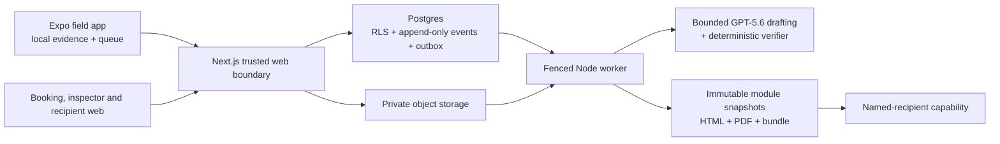

# InspectionHub field-to-report platform

InspectionHub is a mobile-first Building and Timber Pest inspection workflow.
It is designed to let an inspector capture defensible evidence, investigate a
possible defect, review source-grounded AI suggestions, approve each
professional module independently and leave the site with delivery sent or
durably queued. Recipients get separate, plain-language Building and Timber
Pest reports instead of a merged score or purchase recommendation.

> **Current status — 16 July 2026:** active Build Week implementation. The
> repository is not yet a completed submission or a production service. The
> physical-iPhone journey, live GPT-5.6 comparison, public demo, human sample,
> accessibility audit, public video and published submission description remain
> unproven. The [public source repository](https://github.com/chrisohalloran/inspectionhub)
> has been checked logged out, but the milestone validator still emits `blocked`,
> never a completion event.

## Product principles

- Capture acknowledgement never waits for network or AI.
- Photos remain useful as an inspection-day evidence record even when they are
  not linked to a defect.
- An investigation is a thread of photos, voice notes, measurements, extent
  checks, uncertainty and selected report candidates—not a guessed label on one
  image.
- AI drafts are source-linked suggestions. They cannot classify, approve,
  publish or deliver without the inspector-controlled workflow.
- Building and Timber Pest have separate taxonomies, conclusions, immutable
  versions and approvals.
- The report describes observed property condition. It does not give buy/don't
  buy, negotiation, valuation, repair-cost, legal, settlement or warranty
  advice.

## Architecture



The MVP is a modular monolith with a separately deployed worker. Postgres is
canonical; large media lives in private object storage; every meaningful
transition is durable and append-only. Model judgment is contained inside a
thin runner with packet-bound read tools, deterministic guards and a verifier.
See [architecture](docs/submission/architecture.md) and the accepted
[deployment topology](docs/decisions/deployment-topology.md).

## Repository map

| Path                           | Responsibility                                                    |
| ------------------------------ | ----------------------------------------------------------------- |
| `apps/mobile`                  | Local-first field capture, recovery, investigation and review     |
| `apps/web`                     | Booking, inspector surfaces and named-recipient report experience |
| `apps/worker`                  | Durable async task execution                                      |
| `packages/*`                   | Narrow domain, reporting, delivery, security and provider modules |
| `supabase`                     | Postgres migrations and integration tests                         |
| `evals`                        | Development and locked-holdout agent evaluations                  |
| `scripts/milestone-build-week` | Fail-closed 100-point evidence manifest                           |
| `scripts/demo-seed`            | Deterministic synthetic/de-identified golden path                 |

## Local setup

Requirements: Node.js 22 or later and pnpm 10.29.3.

```bash
corepack enable
pnpm install --frozen-lockfile
cp .env.example .env.local
pnpm dev
```

The default adapter mode is `fake`. Never add service-role or provider secrets
to `NEXT_PUBLIC_*` variables, source files, fixtures or manifests. See the full
[setup guide](docs/submission/setup.md).

## Verification

```bash
pnpm design:lint
pnpm lint
pnpm typecheck
pnpm test
pnpm build
pnpm test:integration
pnpm test:e2e:web
pnpm test:e2e:mobile
pnpm test:soak
pnpm test:eval
pnpm test:pdf
pnpm test:security
pnpm milestone:build-week
```

`pnpm milestone:build-week` is expected to fail closed until every automated,
physical, public and human prerequisite has checksum-linked observed evidence.
The gate rejects missing or duplicate rubric IDs, more than 10 N/A points,
N/A must-pass checks, unresolved P0/P1 findings and unverified external claims.

## Privacy, professional and standards boundary

The Build Week path uses synthetic/de-identified data and fake/test adapters.
Original evidence is private, recipient access is named and capability-scoped,
and validation manifests contain hashes and references rather than report,
media, transcript or secret payloads.

This software assists a qualified inspector; it does not create a licence,
replace professional judgment or itself certify compliance with an Australian
Standard or Queensland legislation. The repository contains versioned,
draft-unverified requirement matrices, not reproduced Standards text. Licensed,
legal, privacy and Standards-derived matrix review is a Revenue Activation
gate. See [privacy and limitations](docs/submission/privacy-limitations.md).

## Build Week submission

- [Submission status and asset checklist](docs/submission/README.md)
- [Under-three-minute demo script](docs/submission/demo-script.md)
- [Devpost copy](docs/submission/devpost-copy.md)
- [How Codex and GPT-5.6 are used](docs/submission/codex-and-gpt.md)
- [Build Week evidence status](docs/validation/build-week/README.md)

No public URL, video URL, repository URL or Devpost submission is represented
as verified until the logged-out checks appear in the immutable milestone
manifest.
