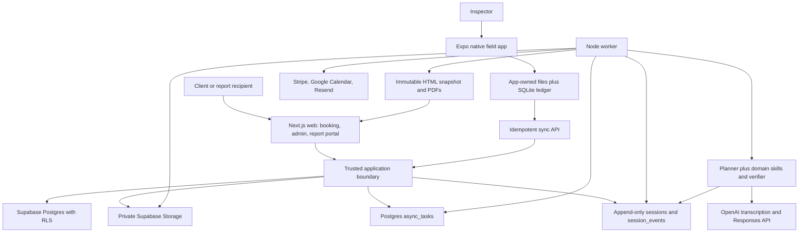
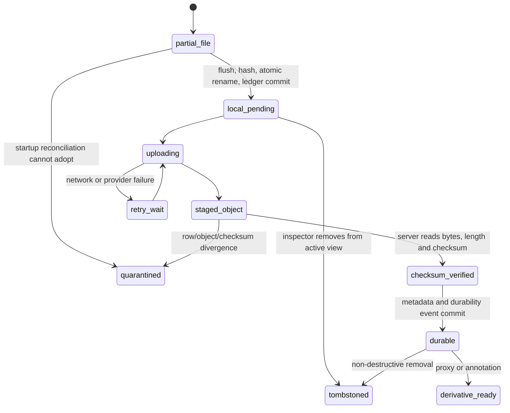
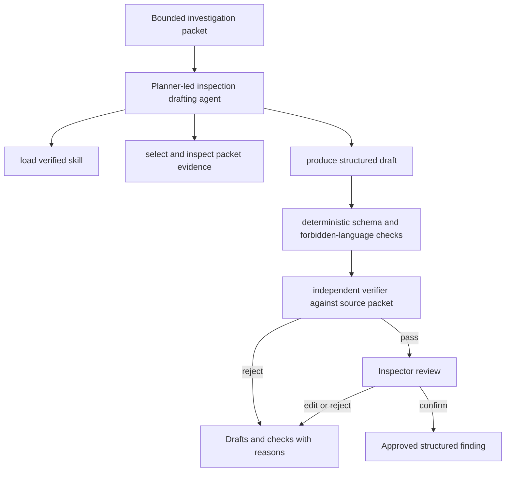
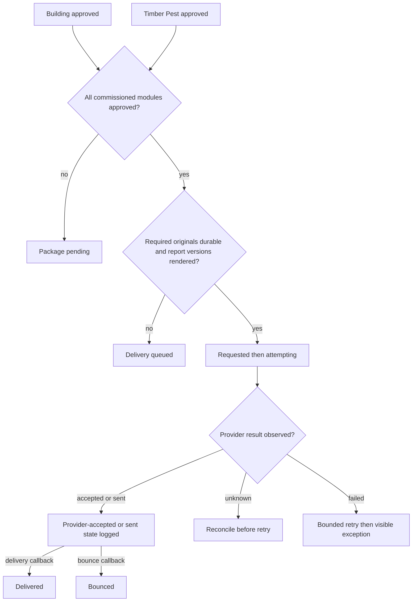

# Building and Timber Pest Inspection Platform - Plan

## Goal Capsule

- **Objective:** Deliver one shared platform that automates booking and pre-inspection administration, lets an inspector complete a combined Building and Timber Pest walkthrough without office reconstruction, and gives recipients a clear, secure property-condition experience backed by separately governed reports.
- **Product surfaces:** `inspectionhub.co` is the inspector and business workspace. `seeitinspections.com.au` is the consumer booking and report experience. `buildingpestinspectiongoldcoast.com.au` is an acquisition domain that redirects to the relevant service landing page.
- **Execution profile:** Deep, high-risk, code implementation. The system handles evidentiary media, professional opinions, payments, personal information, AI-generated drafts, and externally delivered reports.
- **Authority hierarchy:** Explicit user decisions and repository instructions outrank this plan. The Product Contract outranks implementation convenience. Key Technical Decisions constrain implementation unless repository evidence discovered during execution proves a conflict.
- **Tail ownership:** A single Codex `/goal` owns implementation and verification, but it must land the independently completable Build Week milestone before proceeding to Revenue Activation. Missing a revenue-only dependency must not prevent a valid Build Week submission, and passing the Build Week gate must never be reported as real-customer readiness. Progress is tracked outside this file. The plan remains the immutable execution contract.
- **Completion boundary:** “Finished onsite” means the inspector has completed every commissioned module review and approval and no office action remains. Delivery may be visibly queued until required originals, report versions, and send results are durable.
- **Stop conditions:** Stop and surface a blocker if implementation would copy protected Standards wording, weaken inspector approval, merge Building and Timber Pest conclusions, expose private evidence, mark an external side effect complete without observing it, or require a product-scope decision that contradicts this contract.
- **External authority boundary:** Building and local testing are authorised by this plan. Enabling live payments, sending real customer messages, changing production DNS, publishing a public production deployment, or submitting to Build Week requires the user to confirm that action when execution reaches it.

---

## Product Contract

### Summary

Build a field-first inspection system around evidence capture and investigation threads rather than isolated photo templates. One physical walkthrough produces separately approved Building and Timber Pest outputs while reusing shared evidence. AI operates as a source-linked scribe and completeness checker; the inspector remains the author of every professional classification, opinion, limitation, conclusion, and recommendation.

The client experience covers quote, booking, scheduling, agreement, payment, access readiness, status, secure report delivery, and amendments. The primary report is accessible semantic HTML, with separate immutable Building and Timber Pest PDFs as formal records and an optional combined download package.

### Problem Frame

The current workflow spends roughly one hour onsite and two hours reconstructing the report afterward. Hundreds of photos include both reportable defects and private coverage evidence retained for dispute protection. Once the inspector returns to the office, photo context, area, sequence, reasoning, uncertainty, and the relationship between images must be reconstructed from memory.

Existing report templates often optimise form completion instead of field capture or recipient comprehension. They can force premature categorisation, hide material limitations in boilerplate, and give non-expert recipients a long document without a clear account of major defects, minor defects, timber-pest findings, or inaccessible areas.

### Actors

- A1. Inspector — conducts one walkthrough, captures evidence, investigates possible issues, confirms professional findings, approves report modules, and owns final wording.
- A2. Business administrator — configures launch services, availability, pricing, inspector credentials, integrations, and delivery exceptions. Agreement, notification, and report templates remain versioned release-managed configuration until repeated post-launch use justifies general-purpose editors. Launch permits A1 and A2 to be the same person.
- A3. Client — requests the inspection, accepts scope, signs, pays, and receives status updates.
- A4. Access contact — confirms property access and receives only access-related communications.
- A5. Report recipient — securely reads, downloads, and shares approved report records. A3 and A5 may differ.
- A6. Post-launch module inspector — may sign one assigned professional module after serial handoff and reassignment workflows are introduced. The launch runtime assigns one eligible A1 inspector to every commissioned module on a job while retaining module-level inspector attribution in the schema.

Permissions arise from explicit assignments and capability grants, not from contact-record equality or matching email addresses.

| Action | A1 Inspector | A2 Administrator | A3 Client | A4 Access contact | A5 Report recipient | A6 Module inspector |
|---|---|---|---|---|---|---|
| Configure services and integrations | No | Yes | No | No | No | No |
| Book, sign, and pay | If explicitly assigned as client | Support/override with reason | Yes | No | No | No |
| Confirm property access | View | Support/override with reason | If assigned | Yes, access only | No | No |
| Capture and edit field evidence | Yes when assigned | No | No | No | No | Yes for assigned module/job |
| Set classification/conclusion and approve module | Yes for eligible assigned module | No | No | No | No | Yes for eligible assigned module |
| Suspend delivery or recipient access | No | Yes, without changing professional status | No | No | No | No |
| Withdraw professional module | Yes for signed module | Suspend only | No | No | No | Yes for signed module |
| Read delivered report/version | If operationally assigned | Yes, audited | Only with recipient grant | Never | Only with recipient grant | Assigned modules/job |
| Invite another recipient | No | Yes | Only if grant permits | No | Only if grant permits | No |

Launch supports one assigned inspector per job and no runtime reassignment. Module-level attribution remains explicit so post-launch serial handoff does not require schema replacement. Every professional mutation still carries an expected revision/hash; stale writes from multiple devices fail into a refresh/compare state rather than being silently merged.

### Requirements

**Shared product and administration**

- R1. The product shall use one codebase and shared domain model for InspectionHub and See It Inspections while presenting host-specific navigation, branding, permissions, and public content.
- R2. A job shall commission Building, Timber Pest, or both, but a combined service shall still produce independently governed module states, conclusions, approvals, inspector attribution, and formal report versions.
- R3. The system shall keep client, report recipient, invoice contact, access contact, property, and assigned inspector as distinct roles and records.
- R4. The launch administration surface shall manage versioned services, prices, availability rules, inspector credentials, and integration status without code edits or raw database access. Agreement, notification, and report-presentation templates shall remain versioned release-managed configuration until post-launch usage justifies safe general-purpose editors.
- R5. Standards-derived product requirements shall be independently worded, source-referenced, versioned, and inspector-verified; the system shall not copy or expose Standards text as product content.

**Automated quote, booking, agreement, payment, and access**

- R6. A client shall obtain a transparent quote from property and service inputs and see separate Building and Timber Pest line items within a combined total.
- R7. Available appointment slots shall account for business availability, temporary holds, existing bookings, buffers, and the configured calendar provider so automated booking cannot create a known conflict.
- R8. A booking shall preserve entered details across payment or provider failure and expose literal readiness states for slot, agreement, payment, and access.
- R9. The client shall sign one versioned agreement journey with visibly separate Building and Timber Pest scope sections and immediately receive the signed record.
- R10. Payments, refunds, calendar events, agreement signatures, reminders, and access confirmations shall be idempotent and driven by observed provider results; cancellation and rescheduling shall use an authoritative booking-change lifecycle that invalidates superseded holds, links, reminders, and provider work.
- R11. The access contact shall receive a scoped confirmation link and the inspection shall not be shown as ready until the required access state is satisfied or explicitly overridden with a reason.

**Field capture and evidence integrity**

- R12. The native field app shall capture photographs and voice notes into locally durable storage before network upload or AI processing.
- R13. An ordinary coverage photograph shall require one capture action and no classification; it defaults to private evidence with job, area, capture time, sequence, device, checksum, and synchronisation state.
- R14. The capture screen shall keep the current area, active investigation, camera, tap-to-record voice control, area change, and local/sync state available without switching between capture modes.
- R15. An investigation thread shall group photographs, voice notes, measurements, observations, and area changes and shall permit recent captures to be attached retroactively.
- R16. One investigation may produce a Building finding, a Timber Pest finding, two linked findings, or no reportable finding without duplicating immutable originals.
- R17. Every applicable area shall receive an inspector-set coverage state of inspected, access limited, inaccessible, not applicable, or revisit; photo quantity shall never infer inspection adequacy.
- R18. Originals shall be immutable. Annotations, crops, compression proxies, captions, and report selections shall be linked derivatives with their own checksums and provenance.
- R19. App restart, forced termination, weak connectivity, permission revocation, lost or replaced device, session expiry, AI failure, upload failure, low battery, and low storage shall have explicit recovery behaviour. An enrolled device with a previously synchronised assignment may continue local capture only for the already-open cached job after session expiry; new job access, server mutations, approval, package confirmation, and delivery require refreshed authentication. Evidence not yet server-durable on a lost device is reported as `evidence_at_risk` rather than hidden behind a zero-loss claim.
- R20. The inspector shall be able to finish and approve onsite while delivery waits in a durable queue for required uploads or provider recovery.

**AI drafting and professional control**

- R21. Every AI run shall bind to one immutable, tenant-authorised investigation-packet revision containing inspector-selected photos, location history, corrected transcript spans, measurements, coverage/limitations, contradictions, unknowns, confirmed observations, prior inspector feedback, module schema, and pinned prompt/model/skill versions. A packet change supersedes older in-flight and completed drafts.
- R22. AI shall not synchronously analyse all coverage photographs, interrupt the shutter path, label the first image as a defect, or infer “no apparent defect” from photo volume.
- R23. AI output shall separate observed facts, apparent extent, construction assumptions, qualified hypotheses, potential consequences, uncertainty, inspector classification, and technically appropriate further investigation.
- R24. Every AI draft shall expose its packet revision, source artifacts, transcript spans, model, prompt and skill versions, authorship origin, structured output, verifier verdict, run/attempt state, and unresolved uncertainties. Sensitive packets, transcripts, outputs, and verdict detail live as protected artifacts; events store only safe metadata, references, policy results, and hashes.
- R25. AI-authored text shall remain provisional until the assigned inspector confirms it. A verifier-rejected or stale draft cannot be confirmed; an inspector edit must be reverified against the exact edited version or explicitly converted to a human-authored version. No unapproved text may enter a module snapshot, report version, or recipient portal.
- R26. The system shall attribute major/minor classifications to the inspector unless a verified rule explicitly supports a different attribution, and it shall never convert a Building classification into a Timber Pest category.
- R27. A separate read-only verifier shall assess the exact draft version against the canonical packet revision and reject unsupported factual additions, lost qualifications, unbounded “not observed” statements, module leakage, transaction advice, valuation, repair-cost estimates, or purchase/negotiation language. Exhausted or malformed verification falls back to the manual path.
- R28. Manual transcription correction, manual finding authoring, manual classification, manual report completion, and delivery shall remain available during complete AI failure.

**Review, reports, delivery, and recipient comprehension**

- R29. Building and Timber Pest shall have separate immutable module snapshots covering findings, coverage, limitations, conclusions, inspector/credential version, requirement/template versions, verifier results, evidence hashes, and media selection. Approval references one exact current snapshot; a substantive change invalidates only that module approval.
- R30. Approval, package confirmation, cancellation, withdrawal, send request, provider acceptance/sent, delivered, bounced, failed, and unknown shall be separate literal logged states; no combined “approve and send” mutation is permitted. A package binds exact module snapshots and the durability manifest, and no send may start after a committed cancellation or withdrawal.
- R31. The recipient portal shall open with a property condition overview that names major Building defects, summarises minor defects, describes Timber Pest findings using its own taxonomy, and highlights material access limitations without a combined score or count.
- R32. Each recipient-facing finding shall show its module, location, inspector-confirmed classification or category, observation, apparent extent, significance, qualified opinion, uncertainty, further investigation when appropriate, curated evidence, and inspector attribution.
- R33. “Not observed” language shall be bounded by the accessible areas inspected and the inspection time. The product shall not use “termite-free,” “passed,” “safe,” “good condition,” or equivalent guarantee language.
- R34. The HTML portal shall be the primary reading experience. Separate immutable Building and Timber Pest PDFs, the signed agreement, invoice, report version history, and an optional combined bundle shall remain available as records.
- R35. Recipient access shall use a deny-by-default capability grant scoped to principal, job, delivered version, permitted modules, actions, expiry, issuer, and revocation. An invitation is separate from authentication, binds to the intended verified mailbox, is single-use, and cannot transfer authority when forwarded. Permanent public bearer links and private coverage-gallery exposure are prohibited.
- R36. Amending a report shall create a new immutable version with author, issue time, reason, and change notice while preserving earlier versions and their delivery history. A signing inspector may withdraw a module without a replacement; an administrator may suspend delivery/access but cannot rewrite professional status. Downloaded copies cannot be recalled and must be handled by notice and audit history.

**Security, operations, and quality**

- R37. Tenant isolation shall be enforced in Postgres and object storage, with least-privilege roles, private buckets, short-lived access, TOTP `aal2` and recent-auth step-up for privileged actions, bounded/revocable staff sessions, environment-separated rotatable service secrets confined to managed trusted runtimes, and no service credentials in clients. Untrusted uploads remain quarantined from AI/rendering until allowlist, decoder and safe-proxy checks pass; recipient-visible fields are context-safely encoded and sanitised under a restrictive CSP.
- R38. The system shall append structurally immutable typed events for user input, model output, tool request/start/result, artifact creation, approval, retry, failure, verifier verdict, delivery, amendment, pause, resume, compaction, and completion. Events use server time, per-aggregate monotonic versions, schema upcasting, redacted payload references, and tamper-evident ordering; application roles cannot update or delete them.
- R39. Every side-effecting provider call and background task shall use a unique idempotency key, request fingerprint, transactional outbox record, bounded retry policy, fenced lease, visible terminal or unknown state, compensating-action posture, and logged observed result. Stale workers cannot commit completion.
- R40. AI requests shall exclude client names, contact details, property address, and unselected private evidence, use opaque identifiers, and set API storage controls according to the approved privacy posture.
- R41. Core web experiences shall meet WCAG 2.2 AA, support keyboard and screen-reader use, reflow at 320 CSS pixels, remain usable at 200% zoom, and never communicate status or severity by colour alone.
- R42. The entire mobile inspector journey, including capture, drafts, completion, approval, queued delivery, and terminal failures, shall support one-handed use, VoiceOver/TalkBack, 200% text scaling, reduced motion, direct sunlight, wet-hand and light-glove testing, 48 by 48 pixel primary targets, and status that does not depend on colour, sound, haptics, or motion alone.
- R43. The release shall provide observable evidence for artifact durability, AI provenance, approval gating, provider side effects, report versions, access, performance, errors, and delivery without logging sensitive media or report content.
- R44. Every data class shall have a configured lifecycle covering retention, tombstone, purge/anonymisation, professional/dispute hold, tenant offboarding, backup expiry, and post-restore suppression. Shared evidence cannot be physically deleted while referenced by a retained module, report version, amendment, or hold.

### Key Flows

- F1. Automated booking and readiness
  - **Trigger:** A3 selects Combined Building + Timber Pest.
  - **Actors:** A2, A3, A4.
  - **Steps:** Quote, slot hold, people/property details, scoped agreement, payment, calendar reservation, access request, readiness reminders.
  - **Outcome:** One job is ready with both modules commissioned and every dependency visibly satisfied or overridden.
  - **Covered by:** R1-R11, R37-R39.

- F2. Continuous field capture
  - **Trigger:** A1 starts the job onsite.
  - **Actors:** A1.
  - **Steps:** Confirm property, pass device preflight, select area, capture private coverage evidence, record voice, move between areas, close areas, recover from interruptions.
  - **Outcome:** Every artifact is locally durable and every applicable area has an inspector-set state.
  - **Covered by:** R12-R20, R38-R39, R42-R43.

- F3. Investigation-to-finding
  - **Trigger:** A1 notices a possible issue and starts an investigation.
  - **Actors:** A1.
  - **Steps:** Attach recent evidence, add overview/close-up/context photos, dictate observations, inspect adjacent or external areas, finish the packet, receive a draft and verifier result, edit and confirm one or two module-specific findings.
  - **Outcome:** An inspector-confirmed finding retains source and uncertainty provenance without anchoring the inspector to the first image.
  - **Covered by:** R15-R18, R21-R28, R38, R40.

- F4. Module review, approval, and queued delivery
  - **Trigger:** A1 finishes the walkthrough.
  - **Actors:** A1 at launch; A6 is post-launch.
  - **Steps:** Resolve Building checks, approve Building, resolve Timber Pest checks, approve Timber Pest, confirm package, generate immutable versions, wait for evidence durability if needed, send, observe result.
  - **Outcome:** No office action remains; the package is delivered or durably queued with a clear exception.
  - **Covered by:** R20, R25-R30, R34, R38-R39, R43.

- F5. Recipient condition understanding
  - **Trigger:** A5 opens a verified invitation.
  - **Actors:** A3, A5.
  - **Steps:** Review condition overview, open Building and Timber Pest modules, inspect limitations and curated evidence, download records, invite a named recipient if permitted.
  - **Outcome:** A non-expert can identify material findings and important inspection limitations without transaction advice.
  - **Covered by:** R31-R35, R41.

- F6. Amendment and dispute trace
  - **Trigger:** A1 determines that an approved report requires correction, either proactively or after reviewing a question from an authorised A5 report recipient.
  - **Actors:** A1, A2, A5.
  - **Steps:** Preserve the original, record reason, create the amended version, rerun approval and delivery gates, notify named recipients, retain access and delivery history.
  - **Outcome:** The current report is unambiguous and prior evidence and versions remain auditable.
  - **Covered by:** R18, R24-R25, R30, R35-R39, R43.

### Acceptance Examples

- AE1. Coverage photo with no issue
  - **Given:** The inspector is in `Second floor / Main bathroom` with no active investigation.
  - **When:** One photo is captured in airplane mode.
  - **Then:** The original is durably stored once, tagged private coverage evidence, assigned the current area and sequence, and queued without asking for a classification.
  - **Covers:** R12-R14, R18-R19.

- AE2. Cracked bathroom tile investigation
  - **Given:** Several cracked tiles appear in a second-floor shower base and bathroom floor and the construction is not visually confirmed.
  - **When:** The inspector starts an investigation, attaches recent photos, records further evidence, dictates suspected movement and possible membrane damage, and classifies the condition as a major defect.
  - **Then:** The draft distinguishes observations from assumptions and hypotheses, records that the inspector classified the major defect, recommends investigation by a suitably licensed and qualified builder or tiler, and contains no purchase or settlement advice.
  - **Covers:** R15-R16, R21-R28, R32.

- AE3. Cross-area investigation
  - **Given:** A suspected moisture pathway begins inside and is checked in an adjacent room and on the external wall.
  - **When:** The inspector changes areas while the investigation remains active.
  - **Then:** Each artifact keeps its capture-area metadata while the single investigation retains the complete evidence sequence.
  - **Covers:** R15-R18, R21-R24.

- AE4. Shared Building and Timber Pest evidence
  - **Given:** One timber member photo supports both a Building damage finding and a Timber Pest evidence finding.
  - **When:** The inspector confirms both findings.
  - **Then:** Both findings reference the same original while preserving separate schemas, conclusions, approvals, and report placement.
  - **Covers:** R2, R16, R26, R29, R34.

- AE5. App termination and resume
  - **Given:** An active investigation contains unsynchronised photos and a completed voice note.
  - **When:** The operating system terminates the app and it is reopened without network access.
  - **Then:** The correct job, area, investigation, artifacts, transcript task, and upload queue resume without user reconstruction or duplicate uploads.
  - **Covers:** R12, R18-R20, R38-R39.

- AE6. AI unavailable
  - **Given:** Transcription and drafting providers are unavailable.
  - **When:** The inspector finishes the inspection.
  - **Then:** Capture remains responsive, the inspector can manually author and approve both modules, and delivery is generated without an AI dependency.
  - **Covers:** R19-R20, R22, R28-R30.

- AE7. Access limitation
  - **Given:** The roof void cannot be accessed.
  - **When:** The inspector closes the area as inaccessible and completes the modules.
  - **Then:** Both affected module reviews require an explicit limitation, and the recipient overview makes the material limitation visible before any “not observed” statement.
  - **Covers:** R17, R29, R31, R33.

- AE8. One module not approved
  - **Given:** Building is approved but Timber Pest still has unresolved checks.
  - **When:** The inspector requests package delivery.
  - **Then:** The combined package remains pending, Building approval stays intact, Timber Pest is visibly incomplete, and no final combined email is sent.
  - **Covers:** R2, R29-R30, R34, R39.

- AE9. Upload incomplete at departure
  - **Given:** Both modules are approved but required originals are not yet server-durable.
  - **When:** The inspector leaves site.
  - **Then:** The job reads `Delivery queued — evidence synchronising`, retries continue automatically, and delivery occurs only after checksum-confirmed durability.
  - **Covers:** R20, R30, R38-R39, R43.

- AE10. Recipient comprehension
  - **Given:** A report has one major Building defect, multiple minor defects, no visible timber-pest activity in accessible inspected areas, and an inaccessible roof void.
  - **When:** A non-expert opens the condition overview.
  - **Then:** Within 30 seconds they can state those four facts without seeing a combined score, buy/don’t-buy signal, or guarantee.
  - **Covers:** R31-R35, R41.

- AE11. Payment webhook replay
  - **Given:** A payment provider sends the same successful webhook three times.
  - **When:** The events are processed concurrently.
  - **Then:** One payment transition, one calendar booking, and one readiness notification are recorded, with every replay acknowledged and logged.
  - **Covers:** R8-R10, R38-R39.

- AE12. Report amendment
  - **Given:** Version 1 was delivered and the inspector corrects a finding caption.
  - **When:** The amendment is approved.
  - **Then:** Version 2 is issued with a change notice, version 1 remains retrievable by authorised staff, recipients see version 2 as current, and delivery history records both sends.
  - **Covers:** R30, R34-R36, R38-R39.

- AE13. Paid booking is rescheduled
  - **Given:** A combined inspection is paid and confirmed while the calendar provider is delayed.
  - **When:** The client reschedules once and then repeats the request on a weak connection.
  - **Then:** One new slot becomes authoritative, the old hold/event/access link/reminders are invalidated or reconciled, payment remains attached, and provider partial failure is visible without duplicate bookings or refunds.
  - **Covers:** R7-R11, R38-R39.

- AE14. Client, report recipient, and access contact differ
  - **Given:** A3 books and pays, A4 confirms access, and a different A5 is named to receive reports.
  - **When:** The invitation is forwarded to A4 and opened from a session authenticated to the wrong mailbox.
  - **Then:** Redemption fails closed, A4 remains access-only, and the server sends a fresh OTP only to A5’s stored address without exposing report or property evidence.
  - **Covers:** R3, R11, R35, R37-R39.

- AE15. Offline stale approval is rejected
  - **Given:** The assigned inspector holds an offline Building module revision on one enrolled device while the same inspector edits and advances that module from another device.
  - **When:** The older device reconnects and submits approval for its revision.
  - **Then:** The stale command is rejected into a refresh/compare state, the Timber Pest module is unaffected, and no mixed-version package is created.
  - **Covers:** R2, R29-R30, R38-R39.

- AE16. Report is withdrawn while delivery is queued
  - **Given:** A combined package is queued but not sent and the signing Building inspector discovers a material error.
  - **When:** The inspector withdraws the Building module.
  - **Then:** The package is cancelled before send, recipient access to the withdrawn version fails closed, the prior audit remains staff-visible, and a replacement requires a new snapshot and approval.
  - **Covers:** R29-R30, R35-R39.

- AE17. Device is lost before full synchronisation
  - **Given:** A device is lost in airplane mode with some originals not server-durable.
  - **When:** The administrator revokes the device and the inspector enrols a replacement.
  - **Then:** Server-durable work resumes, the old device is denied when it reconnects, unsynchronised evidence is marked `evidence_at_risk`, and the affected module requires revisit or an explicit incomplete/limitation outcome rather than claiming zero loss.
  - **Covers:** R18-R20, R37-R44.

### Success Criteria

- A representative 60-minute job containing 300 photographs and 30 voice notes loses zero artifacts through airplane mode, reconnection, forced termination, and retry.
- Shutter acknowledgement is at or below 150 ms p95 and local durable save is at or below 750 ms p95 on the defined launch-device profile, independent of network and AI.
- Voice recording starts within 300 ms p95; transcript availability is within 15 seconds p95 and a first investigation draft is within 60 seconds p95 on the defined baseline 4G profile.
- A ten-finding representative inspection can be reviewed, approved, and queued for delivery within five minutes after the walkthrough; no standard job requires a desktop.
- One hundred percent of AI-authored recipient-visible text has a recorded inspector confirmation and inspectable evidence/transcript provenance.
- The critical AI evaluation set produces zero unsupported facts, zero lost uncertainty qualifiers, zero transaction-advice violations, and zero module-taxonomy leakage.
- At least 90% of representative non-expert users can identify major Building defects, whether visible timber-pest evidence was observed, and any material inaccessible area within 30 seconds.
- At least 80% of representative clients complete quote, booking, agreement, and test payment unaided within five minutes.
- The condition overview’s meaningful content loads within 2.5 seconds p75 on the defined mobile 4G profile and galleries load progressively.
- All must-pass gates in the Quality Rubric pass; the weighted release score is at least 90 out of 100.
- After the user authorises Revenue Activation, the first legitimate paid inspection booked end-to-end through the canonical public experience is recorded as the commercial-validation outcome with funnel and observed provider evidence. Customer demand is an outcome metric, not a software-completion gate that the implementation can fabricate.

**Versioned launch benchmark profile**

- U1 creates `benchmarks/launch-profile.yaml` before U4 performance work. Build Week records the inspector's actual physical iPhone model, OS/build, free storage and battery/thermal state; Revenue Activation additionally uses an iPhone 12 and Pixel 6, or slower supported devices documented before results are run, as the support floor.
- Camera fixtures are 12-megapixel HEIC/JPEG originals with an observed real-property byte distribution recorded from a 30-photo calibration set; the soak preserves its median, p95 and maximum rather than using tiny generated images.
- The 30 voice notes use a predeclared distribution of 15-90 seconds with median at least 30 seconds and include background-noise fixtures. The run starts with at least 5 GB free, battery at or above 50%, normal thermal state and consumer backup disabled.
- Baseline 4G is shaped to 80 ms round-trip latency, 10 Mbps down, 3 Mbps up and 1% packet loss. The adverse profile is 400 ms, 2 Mbps down, 750 Kbps up, 5% loss plus one 20-minute offline interval. AI/provider SLOs identify which profile they use.
- After ten unmeasured warm-up captures, collect at least 300 shutter/local-save samples, 30 voice-start samples and the full investigation-draft sample. Calculate percentiles by nearest-rank from raw timestamped observations; never delete outliers or change the profile after seeing results. The evidence manifest records device, OS, app/runtime, media distribution, network shaper, thermal/battery/storage start and raw sample checksum.

### Scope Boundaries

**Included in the Build Week and revenue-launch path**

- One combined Building + Timber Pest service with separately governed outputs.
- Automated quote, scheduling, agreement, test/live-payment adapters, access confirmation, reminders, and status.
- Native local-first field capture, investigations, coverage ledger, AI drafts, review, approval, durable delivery queue, HTML portal, PDFs, report versions, and named recipient access.
- One organisation at first launch, with tenant-safe schema and permissions so SaaS expansion does not require data-model replacement.
- Host-based product surfaces and the minimum public pages needed for service acquisition and product explanation.
- A public demo, demo data, a sub-three-minute product video script, repository documentation, validation evidence, and a Build Week submission pack.

The Build Week milestone uses synthetic/de-identified data, deterministic provider fakes or authorised test modes, seeded versioned configuration, one physical-device golden path, one demonstrated offline/retry recovery path, source-grounded AI with inspector approval, a secure recipient experience, public demo verification, and the submission pack. It may use provider-hosted primitives such as Stripe Checkout and preconfigured calendar/email adapters; it does not require live charging, broad administration editors, production restore targets, recruited full-size human samples, Android device breadth, or a real customer.

Revenue Activation follows on the same code and data contracts. It adds live provider credentials and reconciliation, privileged-account MFA and step-up, licensed-inspector verification of both professional matrices and report/agreement content, privacy/terms/business identification, complete administration controls required for daily operation, measured lifecycle/restore proof, defined iOS and Android launch-device coverage, full human-validation samples, canonical production-domain verification, and real-customer release controls.

**Deferred until evidence justifies them**

- Proactive AI defect detection across all coverage photos.
- Fully offline AI transcription or drafting.
- Bluetooth instruments, watch/headset controls, runtime module reassignment, serial cross-inspector handoff, multi-inspector live collaboration, route learning, organisation analytics, multilingual reports, and recipient chat.
- Custom organisation template marketplaces, conveyancer accounts, and broad CRM/marketing automation.
- Automated Standards updates. Standards-derived requirements remain human-reviewed and versioned.

**Outside the product identity**

- Purchase, settlement, negotiation, valuation, insurance, or legal advice.
- Repair-cost estimation or contractor marketplace recommendations.
- Pest treatment, destructive inspection, invasive testing, or guarantees that concealed defects or pests do not exist.
- An overall property score, traffic-light buy signal, or merged Building and Timber Pest risk taxonomy.

### Product Dependencies

- A licensed inspector must validate the independently worded Building and Timber Pest requirement matrices, report fields, agreement content, and example outputs before real-customer release.
- Live revenue requires verified Stripe, calendar, email, DNS, privacy, terms, and business-identification configuration. The code must run against fakes or test modes before these are available.
- The OpenAI privacy posture must be documented for the chosen account. `store: false` does not by itself promise Zero Data Retention; provider retention and eligibility must be reflected accurately in the privacy notice.
- App Store distribution is not required for the Build Week demo. A development/adhoc build on a physical launch device is required for meaningful field validation.

---

## Planning Contract

### Key Technical Decisions

- KTD1. One monorepo and one backend, two branded surfaces. Use a pnpm/Turborepo TypeScript monorepo with `apps/mobile`, `apps/web`, `apps/worker`, and shared packages. Next.js host routing separates InspectionHub and See It Inspections without creating divergent products.
- KTD2. Native field capture, web administration and reporting. Use Expo/React Native for the field client because camera output is temporary until copied to durable app storage and the workflow requires local filesystem, persisted SQLite state, restart recovery, background queues, haptics, and device testing. Use Next.js for booking, administration, recipient reports, and public acquisition pages.
- KTD3. Local-first evidence uses a recoverable two-resource protocol, contingent on a blocking native-storage capability spike. Before the Build Week U4 slice, U1 must prove on the physical Build Week iPhone that the selected development-build native dependency can durably synchronise a file, atomically rename within one filesystem, and surface failures. Before Android support or U12 can complete, the identical oracle must pass on the declared Android support floor. If Expo's current surface cannot prove that boundary, implement the narrow cross-platform native module; `close` or `rename` alone is not treated as durable flush. The accepted protocol generates a capture ID, writes a partial file, durably synchronises it, hashes it, atomically renames it into the app-owned immutable path, then transactionally inserts the SQLite artifact and queue rows before acknowledgement. Startup reconciliation adopts or quarantines unacknowledged orphans without issuing a second capture identity. Local cleanup waits for server durability and retention eligibility.
- KTD4. Modular monolith with a boring fenced worker. Use Supabase Postgres, Auth, and private Storage; a Next.js server boundary for trusted web actions; and one Node worker that leases rows from an `async_tasks` table with `FOR UPDATE SKIP LOCKED`, generation/fencing tokens, heartbeats, guarded completion, and a transactional outbox. Do not introduce a separate message broker for the MVP.
- KTD5. Append-only continuity and observed side effects. `sessions`, `session_events`, `artifacts`, `async_tasks`, and `outbox_records` form the durable continuity layer. Events have server time, unique per-aggregate monotonic versions, schema upcasters, and tamper-evident hash chaining or checkpoints; database permissions deny update/delete. Each domain transition, event append, read-model mutation, and outbox insert shares one Postgres transaction. Provider states remain literal, unknown outcomes reconcile before retry, and external rollback is a compensating action.
- KTD6. Shared evidence, separate professional modules. `artifacts` are job-level evidence. `findings`, `coverage_entries`, `conclusions`, `approvals`, and `report_versions` are module-scoped. A join can reference one artifact from both modules without copying it or merging professional logic.
- KTD7. One model-controlled drafting loop with narrow read/provisional-write tools and a verifier. The OpenAI Agents SDK planner is the default candidate behind an application-owned runner, but the thin Responses structured-output path is selected when either persistence/privacy/recovery constraints fail or U7's predeclared correction, latency and cost comparison fails. The selected model loop may read one authorised packet revision, fetch packet-authorised proxies/spans, load an allowlisted module-compatible verified skill when using the planner, read verified requirement metadata, and append an idempotent provisional draft/check with the expected revision. It cannot choose authoritative packet membership, record verifier verdicts, classify or conclude authoritatively, approve, manage recipients, send, or invoke payment/calendar/email. Deterministic code owns schemas, permissions, rendering, checksums, state transitions, retries, provider calls, verifier invocation, and verdict persistence.
- KTD8. Immutable packet revision is the AI context boundary. Voice transcripts are the semantic index. Only inspector-selected proxies and evidence are sent, not hundreds of coverage originals. Evidence selection means attention within the bounded packet; the planner cannot discard contradictory evidence or expand scope. The verifier receives the canonical packet and exact draft version, never a planner summary. Any packet change supersedes older attempts.
- KTD9. Inspector approval is a server-authenticated, tamper-evident audit boundary, not a cryptographic signature unless a real signing scheme is implemented. Approval references an immutable module snapshot whose canonical hash covers the exact findings, module, packet/source versions, coverage, limitations, conclusion, media/evidence hashes, authorship origin, prompt/model/skill/verifier versions, inspector identity and credential/assignment state, requirement/template versions, and time. Any substantive change creates a new snapshot and invalidates only the affected module approval.
- KTD10. Semantic HTML is canonical presentation; PDFs are versioned renderings. Store an immutable report snapshot as structured JSON, render the portal from it, and generate PDFs through the worker from the same snapshot. PDF generation cannot become the source of truth.
- KTD11. Recipient access is mailbox-verified and capability-bound. A report invitation contains only a one-time identifier; redemption requires a fresh OTP sent to and authenticated as the stored recipient mailbox. The resulting grant binds principal, job, delivered version, permitted modules/actions, expiry, issuer, and revocation. Every HTML, PDF, media, range-download, and share request checks the current grant and curated artifact allowlist. This proves mailbox control, not real-world identity. Avoid long-lived Storage signed URLs because their expiry is not revoked by normal Auth-key rotation.
- KTD12. External services sit behind adapters. Implement Stripe Checkout/webhooks, Google Calendar FreeBusy/event creation, and Resend email through interfaces with deterministic fakes. This keeps local tests complete and prevents provider setup from controlling domain logic.
- KTD13. AI data minimisation is enforced before the provider boundary. Strip names, contact details, street address, and unselected evidence; use opaque job/artifact IDs; configure `store: false`; disable or redact sensitive Agents SDK trace payloads; record the payload manifest hash but never sensitive payload content in logs. Postgres events/artifacts remain canonical rather than SDK session or trace state. Production launch requires an accurate retention disclosure rather than an unsupported ZDR claim.
- KTD14. Release is rubric-gated. Passing lint and unit tests is insufficient. Evidence integrity, field ergonomics, AI grounding, recipient clarity, accessibility, performance, security, public-URL behaviour, and submission readiness all have must-pass checks and a weighted score.
- KTD15. Professional concurrency is optimistic and single-inspector at launch. Every finding, coverage, limitation, approval, package, withdrawal, and amendment command carries an expected revision/hash. Stale mutations from multiple enrolled devices are rejected for refresh/compare; professional opinions are never silently merged. Package confirmation freezes the exact commissioned module snapshot set, containing either one module or both, and later edits cancel the queued package. Runtime module reassignment and cross-inspector handoff remain post-launch.
- KTD16. Data lifecycle and restore are explicit. Each data class has retention, tombstone, purge/anonymisation, professional/dispute hold, offboarding, backup expiry, and post-restore suppression rules. Restore occurs in an isolated no-egress environment; workers/providers remain disabled until checksum, event replay, grants, deletions, sessions, and provider truth reconcile.
- KTD17. Production topology is selected before scaffolding. Host the Next.js web surface on Vercel with Sydney-region server functions, Supabase Postgres/Auth/private Storage in `ap-southeast-2`, and the continuously running Node/PDF worker in a container on Fly.io `syd` with pinned Chromium. Use Expo EAS development, preview, and production profiles with app-version runtime compatibility. Vercel, Fly, Supabase, Expo, and provider credentials remain environment-specific in their managed secret stores; the public domains route to the Vercel project through the current DNS provider. U1 records account/plan prerequisites and a topology decision record before creating deploy files.
- KTD18. Privileged authentication, secrets, and untrusted content are enforced centrally. A1/A2 launch accounts require Supabase TOTP MFA and `aal2`; approval, integration/credential changes, recipient-grant changes, exports, and access suspension require recent-auth step-up. Privileged sessions have configured idle/absolute bounds and server-side session-row checks on sensitive actions so revocation does not wait only for JWT expiry. Service secrets are separate per environment and service, least-scoped, runtime-audited, dual-key rotatable, and never application data. Uploaded media remains quarantined until byte, MIME/magic-byte, size/dimension/duration, sandboxed decode, metadata stripping, and safe-proxy checks pass; report fields are plain text or strictly sanitised allowlisted rich text with context encoding and restrictive CSP.

### High-Level Technical Design

Agent runs project the following lifecycle from durable events: `queued`, `context_ready`, `running`, `draft_saved`, `deterministic_rejected`, `verifying`, `ready_for_review`, `verifier_rejected`, `retry_wait`, `failed`, `superseded`, and `cancelled`. Checkpoints occur after packet assembly, every durable tool result, draft persistence, deterministic checks, and verifier verdict. A lost in-flight model call starts a new attempt against the frozen packet; token generation is never treated as resumable. Compare-and-set persistence permits one current reviewable draft per packet revision.

### Core Data and Event Model

| Aggregate | Key records | Invariants |
|---|---|---|
| Organisation | `organizations`, `organization_members`, `inspector_credentials`, `service_configs`, `availability_rules` | Every tenant-owned row carries `organization_id`; exposed tables and Storage objects are protected by tested RLS policies. |
| Customer and booking | `contacts`, `properties`, `quotes`, `slot_holds`, `jobs`, `job_participants`, `agreements`, `agreement_signatures`, `payments`, `access_confirmations` | Roles stay distinct; quote/agreement versions are immutable; provider webhooks are idempotent. |
| Inspection modules | `inspection_modules`, `module_assignments`, `coverage_entries`, `module_conclusions`, `module_snapshots`, `module_approvals` | Module type drives its schema; snapshots freeze complete professional content; only eligible assigned inspectors can approve the exact current snapshot. |
| Evidence | `artifacts`, `artifact_derivations`, `artifact_links`, `voice_notes`, `transcripts`, `measurements` | Originals are immutable and checksum-addressed; derivatives cite parents; tombstones do not erase the evidentiary history. |
| Investigation | `investigations`, `investigation_areas`, `investigation_artifacts`, `investigation_notes` | Location may change per artifact while the investigation remains one ordered evidence thread. |
| Findings | `findings`, `finding_versions`, `finding_evidence`, `finding_verifier_verdicts` | AI drafts are provisional; module, source, uncertainty, inspector confirmation, and version are mandatory before publication. |
| Reports and delivery | `report_versions`, `report_artifacts`, `delivery_packages`, `deliveries`, `recipient_grants` | Packages bind exact current module snapshots and durability manifest; version pointers publish only after rendering; grants are version/module/capability scoped. |
| Agent continuity | `sessions`, `session_events`, `agent_runs`, `async_tasks`, `outbox_records` | Events are structurally append-only and ordered; task leases are fenced; compare-and-set rejects stale results; compaction never deletes raw history. |

Minimum typed event families are `booking.*`, `agreement.*`, `payment.*`, `access.*`, `inspection.*`, `area.*`, `artifact.*`, `investigation.*`, `transcription.*`, `agent.*`, `tool.*`, `verifier.*`, `finding.*`, `approval.*`, `report.*`, `delivery.*`, `recipient_access.*`, `amendment.*`, and `system.*`. Each event carries event ID, organisation, aggregate, per-aggregate version, session, actor, client occurrence time when relevant, server-recorded time, idempotency key when applicable, safe metadata, protected artifact references, correlation/causation IDs, schema version, payload hash, and previous-event hash or checkpoint reference.

### Inspector Screen Contract

| Screen | Primary action | Required states and evidence |
|---|---|---|
| Today | Open the correct job | Appointment, property, modules, access contact, readiness exceptions, offline availability. |
| Job readiness | Start safely | Property confirmation, scope, access, storage, battery, camera/microphone permissions, connection; only critical storage/permission failures block. |
| Start inspection | Establish context | Start time, weather/site conditions, occupancy/utilities/restrictions; optional details may be dictated later. |
| Continuous capture | Capture without waiting | Persistent location, shutter, tap-to-record, start/resume investigation, change area, local/sync state, haptic/visual feedback. |
| Investigation | Build an evidence thread | Overview/close-up/context prompts, measurements, recent-capture attachment, multi-area sequence, raw audio, finish without AI wait. |
| Area close-out | Record inspector coverage judgment | Inspected, access limited, inaccessible, not applicable, revisit; no inferred percentage. |
| Drafts and checks | Resolve bounded work | Source-linked transcript/draft, packet revision, authorship origin, uncertainty, missing fields, verifier rejection, stale/superseded state, reverify edit or continue human-authored, revisit prompt. |
| Completion | Review each module | Findings, coverage, limitations, conclusion, inspector eligibility, report media, unresolved checks, current revision, stale/read-only/refresh-required state, approval state. |
| Delivery | Finish onsite | Separate approvals, exact commissioned module snapshot set, cancellation/withdrawal, durability gate, requested/sent/delivered/bounced/unknown/queued/failed state, intervention only for terminal exceptions. |

### Administration Screen Contract

| Screen | Primary job | Required states and evidence |
|---|---|---|
| Services and pricing | Maintain launch offers | Versioned list, draft edit, validation, effective date, publish confirmation, prior-version readback, unsaved-change guard, no retroactive quote mutation. |
| Availability | Keep booking truthful | Business hours, buffers, blackout dates, calendar connection state, conflict preview, timezone, stale-provider warning, save/retry and audit event. |
| Inspector eligibility | Control professional authority | Credential/licence fields, module eligibility, expiry/status, evidence attachment, publish/revoke confirmation, approval invalidation preview, audited history. |
| Integrations | Operate providers safely | Environment label, connected/attention/disabled state, least-scope setup guidance, test action, last observed result, secret rotation status without exposing values. |
| Delivery and access exceptions | Resolve terminal work | Literal task/provider state, affected immutable version, safe retry/reconcile/suspend/revoke actions, reason capture, expected revision and audit trail. |

Agreement, notification, and report-presentation template editors are not launch screens. Their versioned configuration is changed through a reviewed release artifact until post-launch evidence establishes safe editing and preview requirements.

### Recipient Screen Contract

| Screen | Primary job | Required states and evidence |
|---|---|---|
| Service and quote | Choose without industry expertise | Combined service explanation, distinct outputs, property inputs, line items, total, expiry. |
| Appointment and people | Book the right property and roles | Client, report recipient, invoice contact, access contact, slot hold and expiry. |
| Scope and agreement | Give informed acceptance | Short explanation, separate module sections, material exclusions, version, signer, downloadable signed copy. |
| Payment and readiness | Finish without calling | Recoverable payment/refund, confirmed/reschedule-pending/cancel-pending/cancelled booking, agreement/payment/calendar/access checklist, only client-actionable exceptions. |
| Status | Know what is happening | Confirmed, reschedule pending, cancellation/refund pending or failed, access required, rescheduled, inspection completed, under inspector review, reports available or withdrawn; no provisional findings or live tracking. |
| Secure report entry | Reach the correct report | Single-use invitation followed by fresh OTP to the stored mailbox, explicit grant, wrong-account/expired/forwarded/revoked recovery. Sharing creates a named invitation for the current delivered version only, cannot exceed the inviter's module/action scope, cannot delegate onward-share authority, discloses expiry before send, and exposes sent/redeemed/expired/revoked state plus revoke action. |
| Property condition overview | Understand within 30 seconds | Named major Building findings, minor summary, Timber Pest result in its taxonomy, material limitations, module status and inspector identity. |
| Module report | Understand discipline-specific opinion | Separate Building/Timber Pest navigation, findings, coverage, limitations, conclusion, licence attribution, PDF. |
| Finding detail | Understand evidence and uncertainty | Observation, extent, significance, qualified hypothesis, uncertainty, further investigation, curated original/annotation views. |
| Records and amendments | Retain formal history | Current and prior versions as authorised, signed agreement, invoice, separate PDFs, combined bundle, change notice, and a contact-inspector phone/email handoff carrying only report version and optional finding reference. In-product conversation history and replies remain deferred. |

Every interactive screen contract implements the following state semantics where reachable; a unit test or E2E fixture must prove each applicable cell rather than relying on generic error copy.

| State | Trigger and message contract | Preserved data and actions | Focus, announcement, retry and transition |
|---|---|---|---|
| Loading | First authoritative read; identify the object being loaded, never show false empty/success. | Preserve navigation context; disable mutations whose revision is unknown; allow safe exit. | Focus stays on heading/skeleton container; polite loading announcement; timeout moves to delayed. |
| Empty | Authoritative successful read with no records; explain why and the one valid next action. | Preserve filters/context; enable only creation, capture or return actions allowed to the actor. | Focus empty-state heading; announce absence once; action transitions to the named creation/capture state. |
| Offline | Connectivity unavailable or session cannot refresh; state which local actions remain safe. | Preserve all local input; allow capture only for the already-open cached assigned job; block new-job access, approval, package, provider and grant mutations. | Focus offline banner only when it appears after load; assertive announcement for blocked action; one idempotent reconnect action. |
| Delayed | Operation exceeded its expected acknowledgement window but outcome is not known. | Preserve inputs and idempotency key; prevent duplicate mutation; allow status refresh, safe exit and cancellation only when domain state permits. | Focus status message after the initiating control; polite announcement; retry reconciles the same intent rather than creating a new one. |
| Partial | Some independently useful records/derivatives loaded while another part failed. | Preserve and label trustworthy content; block only actions dependent on missing evidence/version; allow targeted retry. | Focus summary of missing content; announce unavailable count/type; retry retains the same artifact/version identity. |
| Stale | Expected revision, assignment, packet, grant or snapshot no longer current. | Preserve unsaved local work for comparison; block confirmation/approval/send; enable refresh/compare or discard. | Focus conflict heading; assertive announcement; transition only after current revision is loaded and consciously reconciled. |
| Success | Authoritative mutation committed or provider result observed; name the literal state. | Clear only inputs covered by the committed idempotency key; expose next safe action and durable reference. | Move focus to success heading or next task; polite announcement; back/refresh cannot repeat side effect. |
| Recoverable error | Valid retry path exists and terminal truth is known. | Preserve inputs and identity; show cause in plain language, primary retry and secondary safe exit/manual fallback. | Focus error heading; assertive announcement; retry reuses identity and has bounded attempts. |
| Terminal error | Policy, eligibility, corruption, withdrawal, revocation or exhausted recovery prevents continuation. | Preserve audit evidence, never offer a misleading retry; provide named intervention, revisit, manual-authoring or support handoff. | Focus terminal heading; assertive announcement; transition requires a new authorised domain action, not page reload. |

Status remains understandable with colour, sound, haptics, and motion independently disabled. Slot holds and authentication show remaining time and provide pause/extension wherever the applicable accessibility rule requires it.

### Data Lifecycle and Restore Contract

Exact retention periods are deployment configuration validated against professional, contractual, privacy, accounting, and dispute requirements before live activation. The implementation must express these lifecycle classes rather than silently retaining everything forever.

| Data class | While active | Purge/anonymisation gate | Backup and restore rule |
|---|---|---|---|
| Quotes, slot holds, booking drafts | Mutable projection plus append-only safe events | Expiry/cancellation policy and no accounting or dispute hold | Expired drafts remain suppressed after restore. |
| Contacts, properties, roles | Encrypted/tenant-scoped current records | Anonymise when no retained job, agreement, invoice, report, access, or hold requires identity | Restored identity and role grants re-evaluate deletion/suppression ledger before use. |
| Payment and webhook metadata | Minimal provider IDs/statuses; no card data | Accounting/provider obligations and dispute hold | Completed side effects reconcile with provider before workers enable. |
| Private originals and audio | Immutable while retained; UI removal is tombstone | No reference from retained module/report/amendment and no professional/dispute hold | Object and Postgres backup points reconcile by checksum; missing/divergent media fail closed. |
| Report-selected originals and derivatives | Immutable and version-bound | All referencing report versions and holds released | Restored current-version pointers publish only after snapshot and media reconciliation. |
| Transcripts, packets, AI outputs and manifests | Protected artifacts; events store references/hashes | Source/report retention and approved privacy policy | Sensitive SDK traces are not treated as backups or canonical state. |
| Agreements, invoices, module/report versions | Immutable formal records | Applicable legal/accounting/professional expiry and no hold | Preserve version chain; never overwrite with older restored pointer. |
| Recipient grants and sessions | Revocable, capability/version scoped | Expiry/revocation; retain minimal access audit per policy | All restored sessions are invalidated; revocations and deletion suppressions replay before access. |
| Event metadata and validation manifests | Append-only, redacted, tamper-evident | Anonymise/purge only under approved lifecycle without breaking required audit | Replay/upcast and tamper checks pass before projections become authoritative. |
| Backups | Encrypted, access-audited, provider-isolated | Expire on configured schedule; deletion ledger persists until backup expiry | Restore only to isolated no-egress environment; rotate sessions/keys and enable providers after reconciliation. |

Physical deletion of shared evidence is reference-counted across modules, snapshots, reports, amendments, delivery disputes, and holds. Backup recovery targets and measured RPO/RTO are set during production infrastructure setup and recorded in the release manifest; unmeasured “backup exists” is not a passing restore test.

### Implementation Constraints

- Use current stable framework versions at implementation start and commit lockfiles. Pin AI prompt and model configuration in application data or versioned files and record the resolved version in every draft event.
- Use a development build, not only Expo Go, for physical-device validation of camera, local files, audio, termination, background behaviour, haptics, and secure storage.
- Preserve server-side trust boundaries. Clients may request signed upload capability but may not choose arbitrary tenant paths, approval identities, report states, or delivery recipients.
- Keep provider adapters deterministic and retry-safe. Webhook signature verification and replay handling are required before live mode.
- Generate thumbnails and AI proxies independently from originals. Failure to create a derivative cannot corrupt or invalidate the original.
- Do not store protected Standards text, API payload bodies containing report content, raw model reasoning, or sensitive media in logs. Store source references, structured outputs, manifests, hashes, and verdicts.
- Public and recipient pages default to light mode. Field capture uses a high-contrast light theme tested outdoors; no dark-mode work is required for the MVP.
- Create and validate a root `DESIGN.md` before implementing visual surfaces. Its YAML tokens are normative and must be consumed through shared web/mobile theme packages.

### Delivery Sequence

1. Establish contracts, deployment/native-storage decision records, repository foundation, design tokens, local provider fakes, CI, and stable test commands.
2. Build the smallest domain spine and a seeded vertical slice that captures one photo and voice note, forms one investigation, creates a deterministic source-linked draft, records inspector confirmation, and renders the recipient overview. This integration proof must land before broadening any layer.
3. Harden domain persistence, RLS, events, idempotency, report-module invariants, local-first capture, and evidence sync around that slice before enabling real provider mutations.
4. Expand investigation threads, coverage, AI planner/verifier, inspector review, immutable module snapshots, and queued delivery.
5. Add booking/readiness automation and recipient/report surfaces against the same domain model, preferring provider-hosted payment and other commodity primitives behind adapters over custom infrastructure.
6. Pass the Build Week milestone and submit its synthetic public demo before revenue-only work can consume the fixed deadline.
7. Complete the Revenue Activation additions, then run live-provider, full human, security, lifecycle/restore, canonical-domain, and real-customer release gates.

### Milestone Contract

| Milestone | Completion boundary | Required evidence | Explicitly not claimed |
|---|---|---|---|
| Build Week | The seeded end-to-end product and one recovery path work on a physical device and public demo; source-grounded AI, inspector approval, recipient comprehension, automated gates, and submission assets pass using synthetic data and fakes/test modes. | Vertical-slice E2E; physical iOS capture/restart proof; critical AI fixture; secure named test recipient; public demo URL/content; under-three-minute video; repository and submission checks. | Live payments/messages, legal or Standards sign-off, production retention/restore targets, Android production breadth, first revenue, or real-customer readiness. |
| Revenue Activation | Every real-customer dependency, operational control, full validation sample, production topology check, and must-pass release gate is complete and user-authorised. | Live-provider observed results, matrix/content sign-off, MFA/secret controls, measured restore, iOS/Android device matrix, full human sessions, canonical URL/alias proof, first paid-booking metric when it occurs. | Market traction beyond the observed funnel; downloaded-report recall; recovery of never-synchronised evidence from a lost offline device. |

The implementation goal may continue across both milestones, but the Build Week completion event and evidence manifest must be durable and independently reviewable before Revenue Activation begins.

### Risks and Mitigations

| Risk | Impact | Mitigation and proof |
|---|---|---|
| Evidence loss or duplicate upload | Professional and legal exposure | Recoverable local and server two-resource protocols, distinct capture identity/checksum, immutable objects, reconciliation/quarantine, kill-at-every-boundary tests and 300-photo soak gates. Lost unsynchronised device evidence is explicitly outside the zero-loss boundary and becomes `evidence_at_risk`. |
| AI anchors, leaks context, or overstates professional judgment | Incorrect report, privacy and liability | Immutable packet revisions, allowlisted tools/skills, deferred suggestions, canonical verifier context, redacted tracing, stale-run rejection, exact-version approval and critical/trace evals. |
| Building and Timber Pest logic becomes merged | Misleading report and regulatory mismatch | Module-specific schemas, conclusions and approvals, cross-module fixture tests, shared-evidence joins only. |
| Offline scope expands beyond the week | Missed Build Week delivery | Offline capture and recovery are mandatory; offline AI, background OS guarantees, and multi-device collaboration are deferred. |
| Expo camera/cache behaviour is mistaken for durability | Lost originals after OS cleanup | Immediate copy into app-owned files, persisted SQLite ledger, physical-device termination tests, low-storage preflight. |
| Provider callbacks replay, arrive out of order, or have unknown outcomes | Double payment, booking, send, refund, or calendar event | Transactional outbox, stable provider key/fingerprint/external ID, literal states, fenced workers, webhook inbox, reconciliation before retry and crash/replay tests. |
| Approval or delivery races create a mixed-version package | Recipient receives internally inconsistent records | Immutable module snapshots, expected revisions, guarded package/outbox transaction, current-pointer-after-render rule, stale/edit/withdrawal/send interleaving tests. |
| Recipient links expose addresses or evidence | Privacy breach | Named authentication, RLS, private buckets, short sessions, minimal email subjects, access audit and revocation tests. |
| Signed media URL cannot be revoked before expiry | Access remains after recipient removal | Prefer authenticated media proxy/headers; use very short URLs only for bounded downloads and test post-revocation denial. |
| Standards or agreement wording is treated as product copy | Copyright or professional-scope risk | Independently worded verified matrices, source references, versioned review, launch checklist signed by inspector and legal adviser where appropriate. |
| Build Week scope overwhelms quality | Polished demo hides unsafe core | Golden path plus one recovery path first; release gates cannot be waived by weighted score; revenue activation follows the same foundation. |
| OpenAI or other provider data posture is misstated | Privacy and trust failure | Data minimisation, `store: false`, accurate up-to-30-day default abuse-log disclosure unless approved controls apply, DPA/privacy review before real data. |
| PDF and portal drift | Conflicting client records | One immutable structured snapshot renders both; semantic comparison tests assert material field parity. |
| Restore resurrects access, deleted data, stale sessions or side effects | Privacy breach and duplicate external actions | Data-lifecycle matrix, deletion suppression ledger, isolated no-egress restore, checksum/event/provider reconciliation, session rotation and measured restore drill. |

---

## Implementation Units

### Unit Index

| Unit | Title | Key files | Depends on |
|---|---|---|---|
| U1 | Repository, design, and test foundation | `package.json`, `turbo.json`, `DESIGN.md`, `.github/workflows/ci.yml` | None |
| U2 | Domain schema, tenancy, and event continuity | `packages/domain/`, `packages/db/`, `supabase/migrations/` | U1 |
| U3 | Booking and readiness automation | `apps/web/app/(booking)/`, `packages/booking/`, `packages/providers/` | U2 |
| U4 | Local-first mobile capture | `apps/mobile/src/capture/`, `apps/mobile/src/storage/`, `apps/mobile/src/sync/` | U1, U2 |
| U5 | Investigation threads and coverage ledger | `apps/mobile/src/investigations/`, `packages/domain/src/inspection/` | U4 |
| U6 | Server evidence sync and durable work queue | `apps/web/app/api/sync/`, `apps/worker/`, `packages/storage/` | U2, U4 |
| U7 | Planner, skills, verifier, and AI evaluations | `packages/agent/`, `evals/inspection-drafting/` | U2, U5, U6 |
| U8 | Inspector review, approval, and delivery | `apps/mobile/src/review/`, `packages/reporting/`, `packages/delivery/` | U5-U7 |
| U9 | Recipient portal, PDFs, access, and amendments | `apps/web/app/(reports)/`, `packages/reporting/`, `e2e/web/` | U2, U6-U8 |
| U10 | Security, observability, and failure operations | `packages/observability/`, `apps/web/app/(admin)/operations/`, `docs/runbooks/` | U2-U9 |
| U11 | Build Week submission milestone | `scripts/milestone-build-week/`, `docs/submission/`, `README.md` | Build Week slices of U1-U10 |
| U12 | Revenue Activation | `scripts/release-validate/`, `docs/runbooks/launch.md`, deployment configs | U11 Build Week milestone complete |

The milestone cut is explicit; “U1-U10 Build Week slices” does not mean every revenue-only scenario in those units must land before submission.

| Unit | Build Week slice | Revenue addition |
|---|---|---|
| U1 | Repo, DESIGN.md, CI, fakes, topology record, physical iPhone native-storage spike, demo hosting. | Production accounts/plans, Android floor, final DNS/secrets/build channels. |
| U2 | Tenant-safe module/evidence/version/event/outbox spine required by the demo. | Complete lifecycle/offboarding/restore and production-volume migration proof. |
| U3 | Seeded configuration, fake/test quote-to-ready path and launch admin essentials. | Live provider credentials, reconciliation, operational admin and real policy/content sign-off. |
| U4 | Physical iPhone capture/voice/offline/restart/session-expiry golden path. | Android support floor, production device-revocation/loss/cache matrix. |
| U5 | Full investigation, area and coverage interaction because it is the differentiator. | Broader field fixtures and measured three-job validation. |
| U6 | Staged upload, server verification, safe proxy and worker recovery on demo scale plus required soak. | Production limits, quarantine operations and provider-volume reconciliation. |
| U7 | Architecture comparison, development/holdout safety corpus, manual fallback and exact provenance. | Licensed matrix/content sign-off, accepted live cost/privacy posture and broader regression runs. |
| U8 | Independent module snapshots, exact approval/package and fake queued delivery. | Live provider truth, operational exception handling and withdrawal at production boundary. |
| U9 | Named test recipient, secure overview, sharing/revocation, HTML/PDF parity. | Live invitations, full human sample, canonical-domain and long-form record operations. |
| U10 | Demo threat model, RLS/grants, redaction, content safety, essential runbooks and local isolated restore proof. | Production MFA/session/secret rotation, measured RPO/RTO, full backup/provider reconciliation. |
| U11 | Public demo, manifest, video, repository and submission. | None; immutable milestone evidence only. |
| U12 | Not part of Build Week. | Full Revenue Activation contract. |

### U1. Repository, design, and test foundation

- **Goal:** Create a greenfield monorepo whose architecture, visual tokens, scripts, fixtures, CI, and local services make later units independently executable and verifiable.
- **Requirements:** R1, R4, R12, R19, R37, R41-R43; F1-F5; KTD1-KTD3, KTD12, KTD14, KTD17-KTD18.
- **Files:** `package.json`, `pnpm-workspace.yaml`, `turbo.json`, `tsconfig.base.json`, `apps/mobile/`, `apps/web/`, `apps/worker/`, `packages/config/`, `packages/test-fixtures/`, `DESIGN.md`, `.env.example`, `.github/workflows/ci.yml`, `supabase/config.toml`, `vercel.json`, `fly.toml`, `apps/worker/Dockerfile`, `apps/mobile/eas.json`, `docs/decisions/deployment-topology.md`, `benchmarks/launch-profile.yaml`.
- **Approach:** First record the exact Vercel `syd1`, Supabase `ap-southeast-2`, Fly `syd`, pinned-Chromium, EAS channel, DNS, managed-secret, connection-pooling, account-plan and cost assumptions. Define the versioned launch benchmark profile before performance work. Run the KTD3 native-storage spike on the physical Build Week iPhone; add a narrow cross-platform development-build native module if durable synchronisation cannot be proven. U12 repeats the identical oracle on the declared Android support floor before Android support is claimed. Then scaffold Expo, Next.js, and Node worker apps with shared strict TypeScript, lint, formatting, environment validation, test factories, provider fakes, seeded demo identities, and a root theme package. Define semantic design tokens for sunlight-readable field controls, recipient typography, classifications, states, focus, spacing, and motion. Add scripts named in the Verification Contract from the start, even when early scripts contain only applicable suites. `pnpm design:lint` must invoke the local `design-md` validator against the root `DESIGN.md` rather than substituting a generic Markdown linter.
- **Test scenarios:** A clean checkout installs with the locked package manager; missing required environment values fail with named remediation; web/mobile/worker compile; DESIGN.md lint passes; demo data contains distinct actors and both report modules; local fakes can simulate provider success, delay, replay, and failure; deploy configuration targets the recorded regions/runtimes; the native fixture proves durable synchronisation, same-filesystem atomic rename and surfaced failure or blocks U4 with a named native-module task; benchmark validation rejects missing or post-hoc device/workload fields.
- **Verification:** `pnpm design:lint`, `pnpm lint`, `pnpm typecheck`, `pnpm test`, and `pnpm build` are green in CI and locally; deployment/benchmark decision records validate; the physical iPhone native-storage spike either passes its durability oracle or the Build Week U4 slice remains blocked. The Android oracle is a separate blocking U12 gate.

### U2. Domain schema, tenancy, and event continuity

- **Goal:** Implement the relational model, schema validation, RLS, state transitions, append-only events, artifacts, task leases, and idempotency invariants that every surface shares.
- **Requirements:** R2-R5, R18-R19, R24-R26, R29-R30, R34-R44; F1-F6; AE4, AE8, AE11-AE17; KTD4-KTD6, KTD9-KTD16.
- **Files:** `packages/domain/src/`, `packages/db/src/`, `packages/contracts/src/`, `supabase/migrations/`, `supabase/tests/`, `packages/test-fixtures/src/domain/`.
- **Approach:** Define discriminated module schemas, capture identity distinct from content hash, immutable module snapshots/report versions, packet/run attempts, event envelopes, approval hashes, capability grants, webhook inbox, transactional outbox, fenced async-task leases, expected-revision commands, lifecycle holds, deletion suppressions, and guarded transitions. Exposed tables use RLS and indexed tenant/actor columns. Each business mutation, event, read-model change, and outbox insert shares one transaction. Database roles cannot update/delete events; replay uses upcasters and tamper-evident ordering. Rejected or removed evidence uses tombstones until retention permits purge.
- **Test scenarios:** Cross-tenant and actor/capability-matrix reads/writes are denied; one artifact links to two module findings without duplication; identical bytes from two genuine captures remain distinct identities; a Building classification cannot validate in a Timber Pest category field; unapproved/stale/rejected findings cannot enter a module snapshot; snapshot hash covers every professional field; concurrent duplicate idempotency keys produce one transition; stale worker and stale professional revisions are rejected; compaction leaves raw events intact; update/delete, gaps, reordering and mutation of events are detected; old-schema replay equals live projections; amendment and withdrawal preserve prior versions; provider intent and task insertion cannot split.
- **Verification:** Migration reset succeeds from empty database, schema/RLS/authorization/event-integrity tests pass, and deterministic replay reconstructs representative booking, inspection, approval, package, delivery, cancellation, withdrawal, amendment, revocation, and deletion-suppression states.

### U3. Booking and readiness automation

- **Goal:** Deliver the See It Inspections quote-to-ready flow with recoverable state and adapter-backed scheduling, signatures, payment, access confirmation, and reminders.
- **Requirements:** R1, R3-R11, R35, R37-R39, R41, R43; F1; AE11, AE13-AE14; KTD1, KTD4-KTD5, KTD11-KTD12, KTD15.
- **Files:** `apps/web/app/(public)/`, `apps/web/app/(booking)/`, `apps/web/app/(admin)/configuration/`, `apps/web/app/api/webhooks/`, `packages/booking/`, `packages/agreements/`, `packages/providers/stripe/`, `packages/providers/google-calendar/`, `packages/providers/resend/`, `e2e/web/booking.spec.ts`, `e2e/web/admin-configuration.spec.ts`.
- **Approach:** Implement versioned quote rules, slot holds, calendar conflict checks, distinct participant roles, agreement snapshots, Stripe Checkout, webhook inbox, access-contact links, readiness projection, scheduled reminders, and a booking-change lifecycle of confirmed, reschedule-pending, cancel-pending, and cancelled. Build only the Administration Screen Contract's launch controls for services/pricing, availability, inspector eligibility and integration status; agreement/notification/report templates remain reviewed release-managed configuration. Payment/refund, calendar, access, and notification states remain separate literal projections. Define client/admin authority, cut-off policy, old-slot release, stale-link/reminder invalidation, provider reconciliation, and terminal refund failure. Use provider fakes by default and test/live adapters selected by trusted configuration. Never ask the client to repeat captured information after provider failure.
- **Test scenarios:** Complete combined booking in under five minutes; slot expires cleanly; competing clients cannot confirm one slot; two concurrent reschedules resolve once; cancellation races payment replay; payment decline returns to preserved booking; duplicate refund callbacks and weak-network repeat submission do not duplicate effects; calendar cancellation failure reconciles visibly; stale access links fail after reschedule; repeated and out-of-order webhooks create one transition; unsigned agreement and unconfirmed access show only the responsible action; access contact cannot view report data; versioned price publish does not mutate an existing quote; availability conflict preview; credential expiry removes later approval authority; integration test never reveals a secret; unsaved admin edit, permission denial and version-history readback.
- **Verification:** Component and integration tests pass; the web E2E suite covers success, payment failure, webhook replay, slot conflict, expired access link, keyboard completion, 320-pixel reflow, and axe checks.

### U4. Local-first mobile capture

- **Goal:** Make camera and voice capture locally durable, fast, recoverable, and independent of network, AI, or server availability.
- **Requirements:** R12-R14, R18-R20, R37-R44; F2; AE1, AE5-AE6, AE17; KTD2-KTD5, KTD13, KTD16-KTD18.
- **Files:** `apps/mobile/src/capture/`, `apps/mobile/src/audio/`, `apps/mobile/src/storage/`, `apps/mobile/src/sync/`, `apps/mobile/src/jobs/`, `apps/mobile/src/accessibility/`, `apps/mobile/e2e/`.
- **Approach:** Use Expo Camera, FileSystem, SQLite, SecureStore, protected local storage, audio, haptics, and network/battery/storage signals in a development build. Consume only the native durability capability proven in U1, then apply the KTD3 partial-write/durable-sync/hash/rename/ledger protocol and startup reconciliation before capture acknowledgement. Enrol and revoke devices, exclude evidence from consumer cloud backup, require reauthentication for approval, define cache cleanup only after server durability/retention eligibility, and make remote wipe explicitly best effort. After session expiry an enrolled device may continue capture only for the already-open cached assigned job; sync waits safely for renewed auth and all new-job, server-mutation, approval, package, delivery and recipient actions remain blocked. Maintain a deterministic local state machine and recovery projection.
- **Test scenarios:** Capture one photo with no categorisation; take the next photo during upload; record audio while photos queue; inject termination after copy, durable sync, hash, rename, SQLite commit, and acknowledgement; simulate storage exhaustion and truncated files; run twenty minutes offline then reconnect; revoke camera or microphone mid-job with manual-note fallback; lose a fully synced device and an airplane-mode device; reconnect a revoked old device; enrol a replacement; verify local files while device-locked; expire the session while the cached job is open and prove capture continues while new-job/server/approval actions remain blocked; restore auth and sync with the same identities; race server device revocation against old-device reconnect; simulate corrupted file, checksum mismatch, thermal/battery policy and wrong-job selection; confirm no media contents appear in logs.
- **Verification:** Mobile unit/component tests pass; Maestro smoke tests cover start, capture, voice, offline queue, termination, resume, and area change; a physical-device capture run meets latency thresholds.

### U5. Investigation threads and coverage ledger

- **Goal:** Implement the core field interaction from persistent location through bounded investigation and inspector-set area completion.
- **Requirements:** R14-R17, R21-R23, R28-R29, R42; F2-F3; AE2-AE4, AE7; KTD6, KTD8.
- **Files:** `apps/mobile/src/areas/`, `apps/mobile/src/investigations/`, `apps/mobile/src/measurements/`, `packages/domain/src/inspection/`, `packages/test-fixtures/src/investigations/`.
- **Approach:** Keep one capture shell. Starting an investigation is one tap; tap-to-record does not block the shutter. Support attach-recent, pause/resume, ordered cross-area evidence, structured measurements, finish-without-AI, and no-reportable-finding closure. Area close-out records inspector judgement and generates revisit items without percentages.
- **Test scenarios:** Build the cracked-tile fixture; attach three pre-thread photos; continue from bathroom to exterior; close an investigation with no finding; link one investigation to two modules; reassign an accidentally captured area without changing original metadata history; close inaccessible roof void and require limitations; confirm primary controls remain usable at 200% text scale and 48-pixel targets.
- **Verification:** Domain and mobile tests prove investigation ordering, area history, coverage transitions, retroactive linking, and one-handed screen contracts; representative task timing meets the interaction limits.

### U6. Server evidence sync and durable work queue

- **Goal:** Synchronise local artifacts exactly once, verify server durability, derive proxies safely, and run retryable asynchronous work without a separate queue service.
- **Requirements:** R18-R21, R24-R25, R30, R35, R37-R44; F2-F4; AE1, AE4-AE6, AE9, AE11, AE15-AE17; KTD3-KTD5, KTD8, KTD11-KTD18.
- **Files:** `apps/web/app/api/sync/`, `apps/worker/src/tasks/`, `packages/storage/`, `packages/task-queue/`, `packages/providers/openai/`, `supabase/migrations/*async_tasks*`, `tests/soak/`.
- **Approach:** Issue tenant-scoped upload intents to staged immutable keys. Server durability requires an independent byte-length/checksum read, object readability, and one transaction that records verified metadata plus the durability event. Durability does not confer content trust: originals remain quarantined from AI/report/email/PDF paths until configured byte, MIME/magic-byte, dimension/duration and active/polyglot-format checks pass, sandboxed decoders succeed, metadata is stripped and safe proxies are re-encoded. Artifact identity remains distinct from content hash; retries reuse capture ID, while a hash change for that ID is quarantined. Worker leases use fencing tokens and checkpoints, record safe tool events, create proxies/derivatives, supersede AI work on packet change, and dead-letter only after bounded retries. Reconciliation handles object-only, row-only, missing-object, divergent-checksum, duplicate-attempt, unknown-provider, content-quarantine and deletion-suppression states. Delivery fails closed on any manifest divergence or untrusted selected artifact.
- **Test scenarios:** Crash before and after every upload/finalisation boundary; retry partial and duplicated uploads; upload identical bytes for two genuine captures; reject mutation/overwrite, wrong tenant/path/checksum, same capture ID with changed bytes, oversize/dimension/duration violations, MIME/magic mismatch, polyglot/active formats, parser bombs and malformed image/audio; prove metadata is removed and only safe proxies reach AI/report workers; lose worker mid-lease and reject stale completion; reconcile object-only, row-only, missing, divergent and quarantined states; proxy generation fails while original remains durable; task dependencies arrive out of order; packet changes supersede AI tasks; verify 300-photo/30-audio soak with airplane mode and app/worker restart.
- **Verification:** Integration and soak tests show zero missing or duplicate artifact identities, exact checksum reconciliation, safe lease recovery, and bounded terminal failure visibility.

### U7. Planner, skills, verifier, and AI evaluations

- **Goal:** Produce fast, source-linked, structured drafts from bounded investigation packets while preventing unsupported or professionally inappropriate output.
- **Requirements:** R5, R21-R28, R38-R40, R43; F3; AE2-AE7, AE15; KTD5, KTD7-KTD9, KTD13-KTD15, KTD18.
- **Files:** `packages/agent/src/`, `packages/agent/skills/building-inspection/SKILL.md`, `packages/agent/skills/timber-pest-inspection/SKILL.md`, `packages/agent/skills/report-language/SKILL.md`, `packages/agent/src/tools/`, `packages/agent/src/verifier/`, `content/standards/`, `evals/inspection-drafting/`.
- **Approach:** Before committing the runtime, compare the same ten-case development subset through the planner-led Agents SDK path and a deterministic thin Responses structured-output baseline. Keep the planner path only when both have zero critical boundary failures and it produces at least 20% fewer inspector text-correction or missing-field interventions without exceeding twice the baseline p95 latency or cost; otherwise adopt the thin baseline behind the same application-owned runner/tool contracts and record the evidence for deviating from the default architecture. Then implement the selected runner, allowlisted lazy skill registry where applicable, packet/tool policy, durable run/attempt lifecycle, context rebuild, bounded turn/time/cost budgets, compare-and-set provisional persistence, deterministic guards, and separate read-only verifier. The runner—not the model—invokes and records verifier results. Transcribe bounded voice notes with `gpt-4o-transcribe` using Australian English guidance and token confidence where available. Draft with the evaluated GPT-5.6 configuration and `store: false`; disable/redact sensitive SDK trace payloads. A lost model call restarts against the frozen packet. Keep redacted manifests and protected artifacts versioned.
- **Test scenarios:** Ten-case planner-versus-thin baseline with predeclared correction/latency/cost oracle; cracked bathroom tiles, noisy Australian-accent note, contradictory moisture evidence, inaccessible area, no-reportable finding, mixed Building/Pest evidence, unverified construction assumption, “no termites” temptation, attempted repair-cost/purchase advice, missing recommendation, transcript prompt injection, wrong tenant, unselected artifact, wrong-module/unverified skill, malformed tool arguments, sensitive trace leakage, packet edit during run, two concurrent attempts, old verifier result after new packet, crashes after draft/deterministic check/verifier response, provider timeout, malformed output, verifier disagreement, manual completion during total outage, and separate fixed-trial development plus locked-holdout promotion runs.
- **Verification:** `pnpm test:eval` passes critical, weighted, trace, context-parity, stale-race, crash/replay, authority, and privacy thresholds; every fixture is reproducible with frozen packet manifests; critical cases run multiple trials and fail on the worst violation; model/prompt/skill changes fail CI until the regression set is rerun and accepted.

### U8. Inspector review, approval, and delivery

- **Goal:** Let the inspector resolve drafts and checks, independently approve each module, confirm the package, and leave with delivery completed or durably queued.
- **Requirements:** R20, R24-R30, R38-R39, R42-R43; F4; AE6, AE8-AE9; KTD5-KTD6, KTD9-KTD10, KTD14.
- **Files:** `apps/mobile/src/review/`, `apps/mobile/src/completion/`, `apps/mobile/src/delivery/`, `packages/approvals/`, `packages/reporting/src/snapshot/`, `packages/delivery/`.
- **Approach:** Replace flat suggestions with investigation-scoped drafts and checks. Expose authorship origin, packet/source versions, transcript uncertainty, assumptions, verifier/stale/superseded state, and manual reject, reverify-edited, continue-human-authored, or confirm actions. Rejected/stale AI versions cannot be confirmed. Build separate immutable module snapshots and expected-revision approvals. In one guarded transaction, verify the exact current approvals for every commissioned module plus the durability manifest, freeze that commissioned module snapshot set, and create the package/outbox. Every send rechecks cancellation/withdrawal immediately before the provider call.
- **Test scenarios:** Accept/edit/reject AI draft; edit requires reverify or human-authored conversion; rejected/stale draft cannot confirm; edit after approval invalidates only the affected module; Building approved while Pest pending; concurrent devices and offline stale approval are rejected for the single assigned inspector; amendment or withdrawal races queued send; ineligible inspector cannot approve; AI/verifier outage manual path; zero findings with explicit conclusion; incomplete uploads queue; provider success before local logging enters reconciliation; terminal failure requests intervention without ordinary office work.
- **Verification:** Mobile E2E covers the complete cracked-tile journey and all approval gates; integration tests prove no unapproved content or partial combined package can be delivered; ten-finding review meets the five-minute target.

### U9. Recipient portal, PDFs, access, and amendments

- **Goal:** Deliver a secure, accessible, 30-second condition overview with distinct module reports, curated evidence, formal records, sharing, and immutable amendments.
- **Requirements:** R1-R2, R25-R36, R37-R41, R43; F5-F6; AE4, AE7-AE10, AE12; KTD1, KTD6, KTD9-KTD11, KTD14.
- **Files:** `apps/web/app/(reports)/`, `apps/web/app/(auth)/`, `apps/web/app/api/media/`, `packages/reporting/src/render/`, `packages/reporting/src/pdf/`, `packages/recipient-access/`, `e2e/web/report.spec.ts`, `tests/pdf/`.
- **Approach:** Render the immutable version as semantic HTML with a condition overview, persistent module labels, major findings before counts, separate Timber Pest taxonomy, visible limitations, finding cards, curated media allowlist, records, named grant sharing, contact-inspector handoff, amendment and withdrawal notices. Separate one-time invitation from fresh-mailbox OTP authentication. For launch, a share invitation is fixed to the current delivered version, cannot exceed the inviter's module/action scope, cannot delegate onward sharing, discloses expiry before send and exposes sent/redeemed/expired/revoked state plus revoke. Authorise every HTML, PDF, media/range, download, history, and share request against current version/module/action capability. A new amendment becomes accessible only when explicitly delivered. Generate PDFs and bundle from the same plain-text or strictly sanitised snapshot; publish a new current pointer only after rendering succeeds.
- **Test scenarios:** Major/minor/pest/limitation overview; no major defects; bounded no-visible-pest statement; numerous minor defects; shared evidence; client/recipient/access roles differ; invite opened in wrong authenticated account, forwarded, replayed, expired, revoked or role-removed; same email has multiple explicit roles; share-scope escalation and onward-share attempts; expiry confirmation and sent/redeemed/expired/revoked UI; concurrent revocation and in-flight/range/cached request; historical/future version capability; contact handoff includes only report version/optional finding reference; withdrawal racing queued send and portal already open; replacement after withdrawal; stored-XSS fixture; 320-pixel width, 200% zoom, keyboard/screen reader/reduced motion; colour/audio/haptics removed; PDF/HTML parity; no private coverage gallery.
- **Verification:** Playwright E2E, axe, visual-regression screenshots, PDF rendering/parity checks, and moderated comprehension tests meet the recipient thresholds and contain no prohibited language.

### U10. Security, observability, and failure operations

- **Goal:** Make access, sensitive-data handling, provider failures, queues, AI provenance, delivery, and amendments reviewable and operable without exposing report content.
- **Requirements:** R37-R44; F1-F6; AE5-AE6, AE8-AE9, AE11-AE17; KTD4-KTD5, KTD9, KTD11-KTD18.
- **Files:** `packages/observability/`, `packages/security/`, `apps/web/app/(admin)/operations/`, `supabase/tests/security/`, `docs/runbooks/`, `scripts/security-check/`.
- **Approach:** Add structured redacted telemetry, agent-run replay/stuck detection, safe trace inspection, task/provider dashboards, unknown-outcome and outbox reconciliation, access audit/revocation, delivery/withdrawal exceptions, device revocation, rate limits, secure headers/CSP, dependency scanning, lifecycle/hold operations, encrypted backup scope, restore isolation, and measured RPO/RTO. Enforce TOTP `aal2` for privileged actors through RLS/server checks; require recent-auth step-up on the KTD18 action set; configure bounded sessions and verify `auth.sessions` for sensitive mutations. Use deployment-managed, per-environment, least-scoped secrets with audited access, dual-key rotation and emergency revocation. Report snapshots default to plain text; any allowlisted rich text is sanitised and context-encoded for HTML, email and PDF. Admin operations use narrow audited actions rather than raw database access. Restore keeps all egress disabled until checksums, event replay, grants, deletions, sessions, package pointers, and provider truth reconcile.
- **Test scenarios:** Tenant and actor-capability escape, privileged `aal1` denial, stale-AAL step-up, password/MFA/membership/eligibility/device global revocation, bounded idle/absolute expiry, IDOR media, stored XSS across HTML/email/PDF, restrictive CSP, copied invite/different account, concurrent revocation, old device reconnect, webhook forgery, rate-limit breach, service-key leakage, cross-environment key rejection, dual-key rotation with in-flight idempotent work, retired-key denial, malicious filenames/metadata, prompt injection, sensitive trace leakage, provider timeout/unknown outcome, stale lease, dead-letter recovery, event tamper, and backup plus forward recovery after revocation, amendment, withdrawal, deletion and completed provider calls. Prove restore does not resurrect revoked access, purged data, current-pointer regression, stale sessions, secrets or side effects.
- **Verification:** Security tests, dependency/secret scans, manual threat-model review, queue reconciliation, and an operations drill pass with no sensitive payloads in logs.

### U11. Build Week submission milestone

- **Goal:** Land an independently completable, honestly labelled Build Week submission before revenue-only work consumes the fixed deadline.
- **Requirements:** Milestone Contract Build Week row and the declared U1-U10 Build Week slices, exercising R1-R4, R6-R35, the tenant/grant/private-media/untrusted-content clauses of R37, R38-R43, the synthetic/local recovery clauses of R44, F1-F5, AE1-AE11, AE14-AE15, KTD14, KTD17 and the untrusted-content clauses of KTD18. R5 live professional verification, R36 formal correction/withdrawal operations, the privileged-production-auth/secret-rotation clauses of R37/KTD18, the production lifecycle clauses of R44, F6, AE12-AE13, AE16-AE17 and all live-provider/real-customer evidence remain U12.
- **Files:** `scripts/milestone-build-week/`, `scripts/demo-seed/`, `docs/validation/build-week/`, `docs/submission/README.md`, `docs/submission/demo-script.md`, `docs/submission/devpost-copy.md`, `README.md`.
- **Approach:** Run `pnpm milestone:build-week` against synthetic/de-identified data, fakes/test modes, the seeded vertical slice, physical-device golden path and one recovery demonstration. Capture a public demo and prepare a sub-three-minute story showing booking, cracked-tile investigation, AI draft/verifier, independent approvals, queued recovery and recipient comprehension. Persist the completion event/manifest before any U12 work and document how Codex was used without implying live-provider, compliance, Android-floor, restore or revenue proof.
- **Test scenarios:** Fresh bootstrap; seeded golden path; airplane-mode restart; AI/verifier outage manual path; stale offline approval; payment/access fake failure; public report authentication/revocation; public demo HTTPS/content; Build Week human sample; complete demo accessibility paths; under-three-minute rehearsal; logged-out video/repository/demo/submission links.
- **Verification:** `pnpm milestone:build-week` passes at the milestone's applicable 90-point threshold with every Build Week must-pass gate green, the public demo/submission pack is accessible, and the immutable manifest names every U12 dependency as unproven unless separately observed.

### U12. Revenue Activation

- **Goal:** Prove the U1-U11 product on authorised production infrastructure and activate real-customer revenue only after every external, professional, security and operations gate is observed.
- **Requirements:** R1-R44; F1-F6; AE1-AE17; KTD1-KTD18; Milestone Contract Revenue Activation row.
- **Files:** `scripts/release-validate/`, `docs/validation/revenue-activation/`, `docs/runbooks/launch.md`, `docs/runbooks/secret-rotation.md`, `docs/runbooks/restore.md`, `vercel.json`, `fly.toml`, `apps/mobile/eas.json`, `README.md`.
- **Approach:** With user authority, complete the Revenue additions in U1-U10 before evaluating their global unit-completion signals; run live-provider smoke/reconciliation, full inspector/recipient/client validation, production privileged-auth/secret/content controls, lifecycle/restore proof, iOS/Android support floor, canonical-domain/alias checks and first-customer controls. Reference but never overwrite the Build Week evidence. External activation, DNS changes, customer messages and submission remain separately authorised actions whose observed results are logged.
- **Test scenarios:** Live reschedule/cancellation/refund; provider unknown/failure reconciliation; report withdrawal; production lost-device boundary; current/legacy-domain routing; canonical HTTPS/redirect/content checks; full 3G/offline/delayed-callback and partial gallery/PDF journeys; complete human sample; measured isolated restore; iPhone/Android floor; privileged MFA/session revocation; secret rotation/emergency revoke; untrusted-content attacks; logged-out inspection of every public/live link; first paid booking recorded if it occurs.
- **Verification:** `pnpm release:validate` is green at 90/100 or better, every full must-pass gate is green, the exact canonical public URLs/aliases return expected content over HTTPS, live dependencies have observed authorised results, and no Build Week-only proof is misreported as production evidence.

---

## Verification Contract

### Test Layers and Commands

U1 must create these stable scripts. Implementations may compose underlying tools differently, but the public command names and proof outputs remain stable.

| Gate | Command | Proves | Required for |
|---|---|---|---|
| Design contract | `pnpm design:lint` | Root `DESIGN.md` satisfies the `design-md` contract and remains the normative token source. | U1 and every visual change. |
| Static quality | `pnpm lint` | Lint, formatting, forbidden imports, sensitive-log rules. | Every unit and PR. |
| Type contracts | `pnpm typecheck` | Strict cross-package, web, worker, and mobile types. | Every unit and PR. |
| Unit/component | `pnpm test` | Domain transitions, schemas, UI components, queues, adapters, redaction. | Every unit and PR. |
| Database/integration | `pnpm test:integration` | Migrations, RLS, transactions, idempotency, worker leases, provider webhooks. | U2-U12. |
| Web UI E2E | `pnpm test:e2e:web` | Booking, admin, recipient portal, auth, accessibility, responsive states. | U3, U9-U12. |
| Mobile UI E2E | `pnpm test:e2e:mobile` | Capture, voice, investigations, offline queue, restart, review, approval. | U4-U8, U11-U12. |
| AI behaviour | `pnpm test:eval` | Grounding, uncertainty, provenance, language boundary, module separation, latency/cost snapshot. | U7-U12 and every model/prompt change. |
| Evidence soak | `pnpm test:soak` | 300 photos, 30 voice notes, airplane mode, retries, app/worker termination, checksum reconciliation. | U6, U8, U10-U12. |
| PDF parity | `pnpm test:pdf` | Render success, semantic parity, page readability, immutable version metadata. | U9-U12. |
| Security | `pnpm test:security` | RLS, access control, webhook signatures, rate limits, secret/log scans, dependency audit. | U2-U12. |
| Production build | `pnpm build` | Deployable web, worker, and mobile development/release builds. | Every release candidate. |
| Build Week milestone | `pnpm milestone:build-week` | All Build Week-applicable automated gates, physical-device proof, public demo checks, rubric calculation and submission manifest. | Before submission and before revenue-only work. |
| Full release | `pnpm release:validate` | All full gates plus production proof manifest and rubric calculation. | U12 and any real-customer production release. |

### Automated UI Validation

- Web uses Vitest and React Testing Library for components and Playwright in CI for user journeys, role-based selectors, axe checks, keyboard navigation, responsive reflow, network/error states, and screenshot regression at 320 by 720, 390 by 844, 768 by 1024, and 1440 by 1000.
- Mobile uses Vitest or Jest with React Native Testing Library for states and Maestro for simulator journeys. A test-only provider panel may deterministically set network, storage, battery, AI, and upload states but must not ship in production builds.
- PDF tests render every page to images, inspect page count and required text, compare semantic snapshot fields with the portal, and run visual regression on the cracked-tile fixture, no-major-defect fixture, and access-limitation fixture.
- Visual snapshots are reviewed as evidence, not blindly updated. A snapshot change requires a named requirement or DESIGN.md token change and a reviewer note.
- Inside Codex, manual web proof starts in the built-in In-app browser. If it cannot complete the proof, use Computer Use. External browser automation is reserved for the committed automated test suite or when both primary layers are insufficient.
- Critical web and mobile journeys run under throttled 3G, offline/reconnect, delayed/out-of-order provider callbacks, duplicate taps, stale revisions, and partial gallery/PDF failure. Tests assert preserved input, focus destination, accessible announcements, enabled actions, timeout handling, retry identity, and final literal state.

### Physical Field Validation

- Run on at least one current iPhone used by the inspector and one representative Android device or cloud device before broader SaaS launch.
- Perform a 60-minute simulated property walkthrough with 300 photos, 30 voice notes, 10 investigations, multiple area changes, and both report modules.
- Include twenty minutes of airplane mode, one forced app termination, one low-battery transition, a wrong-area correction, a cross-area investigation, a late-attached photo, and a queued-delivery departure.
- Include a device-revocation drill after full sync and a documented lost-device simulation before full sync. Verify old-device denial on reconnect, replacement-device recovery of server-durable work, and `evidence_at_risk` handling without overstating recoverability.
- Record shutter acknowledgement and local-save latency from application instrumentation, then reconcile local artifact IDs/checksums with server artifacts after synchronisation.
- Conduct sunlight, wet-hand, light-glove, one-handed, stairs/hazard interruption, 200% text, haptic-off, and audio-off checks. The test must not encourage looking at the screen while moving through a hazardous area.

### AI Evaluation Set and Rubric

Create a versioned, de-identified corpus under `evals/inspection-drafting/cases/`. Each case contains the packet manifest, transcript/audio fixture where licensed, selected image proxies, expected structured facts, allowed uncertainties, forbidden claims, module, inspector decision, and expected verifier behaviour.

Before prompt iteration, split the corpus by stable case IDs into a development set and a locked holdout. Prompts, examples and thresholds may be tuned only against the development set. Holdout packets and expected outcomes are unavailable to the prompt-authoring loop and are adjudicated by a licensed inspector who did not author that prompt version. Promotion pins model, prompt, skill, temperature/reasoning controls and a fixed trial count; it fails on the worst critical result, never an averaged score. After a holdout case is exposed for debugging, move it permanently into the regression set and replace it with a new blinded case before the next promotion.

The first release set contains at least 30 cases across:

- Major and minor Building defects.
- Timber Pest visible evidence, damage, conducive conditions, and bounded no-evidence language.
- Mixed-module evidence and shared photographs.
- Inaccessible/obstructed areas and material limitations.
- No-reportable-finding investigations and private coverage evidence.
- Noisy Australian English voice, corrections, incomplete sentences, duplicated words, and ambiguous terms.
- Construction assumptions, alternative mechanisms, contradictory evidence, missing extent, and missing recommendation.
- Prompt injection in spoken/transcribed content and prohibited purchase, cost, settlement, or guarantee requests.
- Provider timeout, malformed output, transcription uncertainty, verifier rejection, and manual fallback.

Scoring uses deterministic assertions first, inspector-authored expected facts second, and an LLM judge only as a secondary reviewer. Critical dimensions are pass/fail and cannot be averaged away:

| Dimension | Threshold |
|---|---|
| Observation fidelity | At least 95% of required facts preserved; zero invented material facts. |
| Qualification fidelity | 100% of assumptions, possibilities, and uncertainty remain qualified. |
| Classification authority | 100% attribute inspector classifications correctly; zero autonomous final classifications. |
| Evidence provenance | 100% of factual clauses map to packet artifacts or transcript spans. |
| Module integrity | Zero Building-to-Pest taxonomy leakage or merged conclusions. |
| Professional boundary | Zero purchase, negotiation, valuation, repair-cost, legal, settlement, or guarantee advice. |
| “Not observed” boundary | 100% name accessible inspected areas and time context where applicable. |
| Recommendation boundary | Technical further investigation is preserved without transaction timing. |
| Verifier recall | 100% of seeded critical violations are rejected; at least 95% of seeded non-critical issues are flagged. |
| Verifier specificity | At least 95% of clean/acceptable drafts pass without an incorrect block. |
| Context parity | Agent and verifier manifests contain every authorised artifact, correction, limitation, contradiction and unknown visible in inspector review; privacy omissions are explicit. |
| Tool and authority trace | Allowed skill/tool sequence, packet-bound access and provisional write are correct; zero approval, recipient, delivery or provider action is attempted. |
| Crash, replay and staleness | Every checkpoint/race yields one current reviewable version and one terminal run state; stale results cannot become reviewable. |
| Latency and cost | Transcript and draft SLOs met on the baseline profile; per-job model cost recorded and accepted before live pricing. |

The U7 architecture comparison uses ten development cases only. The release gate uses the full development regression set plus the untouched holdout and reports both separately; a holdout failure cannot be waived by development-set performance.

### Quality Rubric

The rubric is 100 fixed points. Each atomic check scores either zero or its full value from manifest-linked evidence; there is no discretionary partial credit. Revenue Activation requires at least 90/100, every full must-pass gate and at least 70% in each area. Build Week uses the same checks and formula, but an item explicitly deferred by the Milestone Contract may be `not_applicable` only with a named reason and no more than 10 total N/A points; its percentage is earned divided by applicable points. A must-pass gate can never be N/A or averaged away.

| ID | Area | Points | Binary full-credit evidence |
|---|---|---:|---|
| EI1 | Evidence integrity | 6 | KTD3 native capability plus local kill-at-every-boundary reconciliation pass on the benchmark profile. |
| EI2 | Evidence integrity | 5 | Staged object/Postgres finalisation, independent read/length/hash and quarantine reconciliation pass. |
| EI3 | Evidence integrity | 5 | 300-photo/30-note soak has zero lost/duplicate identities within the declared boundary. |
| EI4 | Evidence integrity | 5 | Immutable module snapshots, exact commissioned set, durability manifest and no mixed-version package pass. |
| EI5 | Evidence integrity | 4 | Restart/offline, app/worker crash, fenced lease and unknown-outcome recovery pass. |
| IF1 | Inspector efficiency | 4 | Shutter acknowledgement and durable-save p95 targets pass from raw benchmark samples. |
| IF2 | Inspector efficiency | 3 | Voice-start/transcript targets pass and shutter never waits for AI/network. |
| IF3 | Inspector efficiency | 4 | One-action coverage capture, one-tap investigation, attach-recent and cross-area task tests pass. |
| IF4 | Inspector efficiency | 5 | Ten-finding close-out is within five minutes and no standard job needs desktop reconstruction. |
| IF5 | Inspector efficiency | 4 | Physical sunlight, one-handed, wet-hand/light-glove and adverse-device checks pass. |
| AI1 | AI control | 6 | Development and locked-holdout critical evals have zero material boundary failure across fixed trials. |
| AI2 | AI control | 4 | Clause provenance, qualifications and canonical context-parity checks pass. |
| AI3 | AI control | 4 | Verifier recall/specificity, malformed result and stale-result gates pass. |
| AI4 | AI control | 4 | Exact-version inspector confirmation, edit/reverify and complete manual fallback pass. |
| AI5 | AI control | 2 | Model has zero human/provider authority path and redacted payload/trace policy passes. |
| RC1 | Recipient integrity | 4 | Milestone-required non-expert sample meets the 30-second comprehension task. |
| RC2 | Recipient integrity | 3 | Distinct module navigation, taxonomies, conclusions and inspector attribution pass. |
| RC3 | Recipient integrity | 3 | Finding detail, uncertainty, further investigation and material limitations remain clear and bounded. |
| RC4 | Recipient integrity | 3 | Canonical HTML, PDFs, bundles and immutable version history are semantically consistent. |
| RC5 | Recipient integrity | 2 | Named sharing, revocation, amendment, withdrawal and contact handoff gates pass. |
| AC1 | Accessibility | 3 | Complete web critical journeys pass automated checks, keyboard and screen reader. |
| AC2 | Accessibility | 3 | Complete mobile critical journeys pass VoiceOver/TalkBack and accessible state behaviour. |
| AC3 | Accessibility | 2 | 320-pixel/200% reflow, target size, reduced motion and non-colour/audio/haptic status pass. |
| AC4 | Accessibility | 2 | Milestone-required moderated assistive-technology or specialist journey audit has no blocking finding. |
| SO1 | Security and operations | 2 | Tenant/capability RLS, recipient grants, privileged MFA/step-up and session revocation pass. |
| SO2 | Security and operations | 2 | Quarantined ingestion, sanitisation/CSP, privacy redaction, secret scan and rotation pass. |
| SO3 | Security and operations | 2 | Transactional outbox, provider literal truth, idempotency, webhooks and reconciliation pass. |
| SO4 | Security and operations | 2 | Lifecycle holds and isolated restore prove no data/access/session/side-effect resurrection. |
| SO5 | Security and operations | 2 | Overview performance, redacted operations proof and milestone-appropriate public HTTPS/content checks pass. |

`pnpm milestone:build-week` and `pnpm release:validate` calculate this table directly from the evidence manifest, reject missing/duplicate IDs, enforce the applicable N/A policy and emit per-area subtotals. Rubric or weight changes require a reviewed plan amendment rather than a CI configuration edit.

**Build Week must-pass gates**

- EI1-EI5 pass using synthetic/de-identified fixtures, fakes/test modes and the physical Build Week device.
- Zero unapproved AI text, zero critical/holdout AI violation, zero module leakage and no prohibited transaction/cost/valuation/guarantee language.
- Separate commissioned-module approvals and exact-version package gate pass; no partial or mixed package can render or send through the fake delivery adapter.
- Named recipient authentication, version/module capability, private-media denial and revocation pass on the public demo.
- The physical offline/termination path, complete Build Week iPhone critical journey, web keyboard/screen-reader path and public demo HTTPS/content checks pass.
- The repository, demo video, description and submission links work from a logged-out session and no unresolved P0/P1 implementation or document finding remains.

**Revenue Activation must-pass gates**

- Zero artifact loss or duplicate artifact identities in the release soak.
- Every acknowledged local capture has exactly one valid immutable file and ledger identity; every server-durable artifact has independently verified readable bytes, length and checksum. Divergence fails closed.
- Zero unapproved AI text in any report or recipient response.
- Zero critical AI-eval violations and zero Building/Timber Pest taxonomy leakage.
- No transaction advice, repair-cost estimate, valuation, guarantee, or buy/don’t-buy signal in fixtures or rendered reports.
- Cross-tenant, revoked-recipient, private-media, and forged-webhook security tests pass.
- Building and Timber Pest approvals remain independent and combined delivery cannot finalise early.
- No mixed-version package is possible; every approval/package references exact current immutable snapshots and stale professional commands fail closed.
- No send begins after a committed cancellation or withdrawal; provider accepted/sent/delivered/bounced/unknown states remain literal and traceable.
- Actor/action authorization, named grant scope, forwarded/replayed invitation, revocation, historical-version and private-media tests pass.
- Append-only event mutation/order checks, transactional outbox, stale-worker fencing and unknown-provider reconciliation pass.
- Lifecycle, shared-evidence deletion hold and isolated restore tests prove no revoked access, suppressed data, stale session, current-pointer regression, or external side effect is resurrected.
- The physical-device offline/termination recovery trial passes.
- Automated accessibility has no serious/critical findings and full critical journeys pass with keyboard, VoiceOver, TalkBack, 200% text, reduced motion, audio off and haptics off.
- All canonical public URLs and required legacy redirects are verified over HTTPS against expected product content after deployment.
- No P0 or P1 code-review, security-review, data-integrity, or document-review finding remains unresolved.

### Human Validation

- Build Week requires the licensed inspector to complete one representative cracked-tile plus Timber Pest/access-limitation job using only the field app after arrival; two non-expert recipients perform the 30-second overview/explanation task; two representative clients attempt the fake/test quote-to-access path; and one moderated assistive-technology session or named accessibility-specialist audit covers the critical demo journeys.
- Revenue Activation expands this evidence to three representative inspector jobs, five non-expert recipients and five clients. At least one job emphasises the cracked-tile scenario and one emphasises material Timber Pest/access limitation. The assistive-technology audit covers the complete booking/report path and complete mobile review/approval/delivery path on the launch support floor.
- Every session records time, taps, corrections, missed context, unsafe prompts, office follow-up, device/browser and assistance given. The percentage success criteria report numerator and denominator rather than rounding a small sample into false precision.
- Findings from human sessions are triaged against R-IDs. Critical workflow or comprehension failures block release; preferences that do not affect the contract may be deferred with evidence.

### Public Deployment and Submission Validation

- Build Week verifies the actual public demo URL linked in the submission, not only build logs or localhost. Record HTTPS status, final URL, page title, expected product text, auth boundary and screenshot; a provider project URL is acceptable only when the canonical-domain change has not yet been authorised.
- Revenue Activation verifies the real canonical URLs users open: `inspectionhub.co`, `seeitinspections.com.au`, and `buildingpestinspectiongoldcoast.com.au` plus `www`/legacy aliases defined during DNS setup. Redirects must preserve intended campaign paths and must not expose report identifiers. Record status, final URL, content, auth boundary and screenshot rather than relying on DNS/build dashboards.
- Run a production-mode synthetic booking through authorised test/live configuration, observe the calendar/email/payment results, complete a synthetic inspection, deliver a report to a named test recipient, revoke access, and confirm denial.
- Rehearse the Build Week video under three minutes and verify the public video, repository, README, demo URL, and submission description from a logged-out browser session.
- The submission pack must address the official judging dimensions: technical implementation, design and UX, potential impact, idea quality, thoughtful GPT-5.6 use, and clear communication of problem, solution, and approach.

### Verification Evidence Manifest

Both `pnpm milestone:build-week` and `pnpm release:validate` write a non-sensitive manifest under `artifacts/validation/<run-id>/manifest.json` that names the milestone and records commit SHA, environment type, test commands, start/end times, exit codes, counts, model/prompt versions, benchmark profile/raw-sample checksum, atomic rubric results and N/A reasons, skipped checks, public URLs checked, screenshots/reports by checksum, and reviewer/verifier findings. Large media remains in the artifact store; the manifest stores references and hashes. A later Revenue Activation run references but never overwrites the Build Week manifest.

---

## Definition of Done

### Build Week Milestone Completion

- The seeded capture-to-investigation-to-draft-to-inspector-confirmation-to-recipient-overview vertical slice works end to end before broad layer expansion is treated as progress.
- `pnpm milestone:build-week` is green at the applicable 90-point threshold, every Build Week must-pass gate is green, and no unresolved P0/P1 implementation or document-review finding remains.
- The licensed inspector completes the representative synthetic/de-identified combined inspection on the physical Build Week iPhone and leaves with delivery through the fake/test adapter sent or durably queued, without desktop reconstruction.
- Source-linked AI and its independent verifier pass the development plus locked-holdout critical gate; exact inspector approval and complete manual fallback work during provider outage.
- Two non-expert recipients, two clients and the Build Week accessibility audit meet the milestone Human Validation contract or the milestone remains incomplete.
- The public demo URL is verified over HTTPS from a logged-out session with expected product content and secure named-recipient behaviour; it is explicitly labelled demo/test when live services are not authorised.
- README, architecture, setup, tests, privacy posture, known limitations, Build Week manifest, under-three-minute video, repository and submission description are accessible and complete.
- A durable Build Week completion event/manifest is recorded before revenue-only work begins. The handoff names live providers, licensed/legal review, full human samples, Android floor, measured production restore, canonical domains and first revenue as not yet proven unless separately observed.

### Revenue Activation and Global Completion

- The Product Contract is implemented without broadening into the deferred or prohibited features.
- U1-U12 verification outcomes are met and every requirement, flow, and acceptance example has a passing automated or named manual proof.
- `pnpm release:validate` is green, the quality score is at least 90/100, and every must-pass gate is green.
- The inspector can complete the representative combined inspection and leave with delivery sent or durably queued, without desktop or office reconstruction.
- A non-expert can understand the major Building findings, Timber Pest result, and material limitations within 30 seconds.
- AI drafts are bounded, source-linked, verified, inspector-approved, and manually replaceable. No provider/model outage blocks capture or manual completion.
- Evidence originals, approvals, report versions, recipient access, amendments, provider results, and delivery are immutable or auditable according to this plan.
- Every AI-assisted approval references a non-stale verifier pass for the exact final version or is explicitly human-authored; every run is replayable from durable events/artifacts and no agent trajectory reaches human-only or externally side-effecting authority.
- Every approved package freezes exact current module snapshots and a verified durability manifest; cancellation, withdrawal, stale clients/workers, amendments, and restore cannot produce a mixed or resurrected current package.
- Privacy, security, agreement, Standards-derived matrices, inspector credential presentation, and live provider configuration are reviewed before real-customer activation.
- The actual public canonical URLs and required redirects are verified after deployment with the expected content and access behaviour.
- README, architecture, setup, test, privacy, limitations, runbooks, validation manifest, demo script, and Build Week submission materials are complete.
- The final diff receives adversarial code, security, data-integrity, accessibility, and product-boundary review with no unresolved P0/P1 finding.
- Experimental, abandoned, duplicate, test-only production code, unsafe feature flags, debug endpoints, sensitive fixtures, and dead-end implementations are removed from the final diff.
- Exact commands, observed results, screenshots/manifest references, skipped checks, residual risks, and any external actions awaiting user authority are reported in the goal handoff.

### Unit Completion

| Unit | Done signal |
|---|---|
| U1 | Clean install, builds, DESIGN.md lint, CI, provider fakes, and stable verification scripts are green. |
| U2 | Schema reset, RLS/capability matrix, immutable event ordering/replay, module snapshots, revision conflicts, outbox, fenced leases, lifecycle and idempotency tests are green. |
| U3 | Booking, reschedule, cancellation, refund and failure paths pass E2E with no orphan provider state or superseded links and with accessible responsive UI. |
| U4 | Every acknowledged capture has one valid file/ledger identity; physical-device latency, offline/termination, permission and device-revocation/loss-boundary tests pass. |
| U5 | Investigation and coverage flows handle cross-area, recent attachment, shared evidence, no-finding, and limitations correctly. |
| U6 | Sync/worker integration and full soak independently verify every durable object, quarantine divergence, reject stale workers, and recover every two-resource failure boundary. |
| U7 | Critical/trace/context/staleness AI evals are zero-failure where required, verifier specificity passes, provenance is inspectable, and manual fallback works. |
| U8 | Exact module snapshot review/approval, stale-command rejection, withdrawal/cancellation and queued literal delivery states pass mobile E2E; ten-finding close-out meets target. |
| U9 | Portal comprehension, capability grants, invitation authentication, revocation, withdrawal, accessibility, HTML/PDF parity, sharing, and amendment tests pass. |
| U10 | Threat model, security/event tests, redacted observability, reconciliation, lifecycle holds, isolated measured restore, and exception runbooks pass without resurrection. |
| U11 | Build Week manifest/submission is independently complete, publicly verified and honest about every U12 dependency not yet proven. |
| U12 | Full release, human, live-provider, restore, device-floor, privileged-security and canonical-URL proof are complete with observed authorised results. |

---

## Appendix

### Source and Research Breadcrumbs

- OpenAI Build Week dates, submission components, and judging dimensions: `https://openai.com/build-week/`.
- OpenAI image input and image-detail behaviour for bounded investigation packets: `https://developers.openai.com/api/docs/guides/images-vision`.
- OpenAI structured outputs for schema-constrained drafts: `https://developers.openai.com/api/docs/guides/structured-outputs`.
- OpenAI speech-to-text models and 25 MB bounded-file guidance: `https://developers.openai.com/api/docs/guides/speech-to-text`.
- OpenAI API data retention and Zero Data Retention eligibility caveats: `https://developers.openai.com/api/docs/guides/your-data`.
- OpenAI Agents SDK decision guidance: `https://developers.openai.com/api/docs/libraries#use-the-agents-sdk`.
- OpenAI Agents SDK trace/privacy configuration: `https://developers.openai.com/api/docs/guides/agents/integrations-observability#tracing`.
- Expo Camera temporary native image URI and required durable copy: `https://docs.expo.dev/versions/v55.0.0/sdk/camera/`.
- Expo FileSystem and persisted SQLite storage: `https://docs.expo.dev/develop/user-interface/store-data/`.
- Expo EAS development/preview/production build channels and runtime-version compatibility: `https://docs.expo.dev/build/eas-json/` and `https://docs.expo.dev/eas-update/deployment/`.
- Supabase private Storage, resumable upload support, and RLS: `https://supabase.com/docs/guides/storage` and `https://supabase.com/docs/guides/database/postgres/row-level-security`.
- Supabase Sydney region, TOTP/AAL2 enforcement, and session-control behaviour: `https://supabase.com/docs/guides/platform/regions`, `https://supabase.com/docs/guides/auth/auth-mfa/totp`, and `https://supabase.com/docs/guides/auth/sessions`.
- Vercel Sydney compute region and database-colocation guidance: `https://vercel.com/docs/regions`.
- Fly.io Sydney worker region and Machines runtime: `https://fly.io/docs/reference/regions/` and `https://fly.io/docs/machines/overview/`.
- Stripe idempotent request guidance: `https://docs.stripe.com/api/idempotent_requests`.
- Next.js testing guidance for Vitest and Playwright: `https://nextjs.org/docs/app/guides/testing`.
- Queensland Building and Construction Commission Regulation 2018, supplied by the user and confirmed in force on 2026-07-14: `https://www.legislation.qld.gov.au/view/html/inforce/current/sl-2018-0138`.
- Queensland Building Regulation 2021 may add relevant building context and must be checked by the launch compliance review: `https://www.legislation.qld.gov.au/view/html/inforce/current/sl-2021-0126`.
- AS 4349.1-2007 is the supplied Building inspection baseline. Its live Standards Australia status and any amendments/replacement must be rechecked from an authorised source immediately before implementation of the verified requirement matrix and again before live launch.
- AS 4349.3-2010 is the Timber Pest inspection baseline and Standards Australia listed it as `Pending Revision` on 2026-07-14; its status and any replacement must be rechecked before the verified requirement matrix and live launch: `https://store.standards.org.au/explore-standards/construction?page=35`.

### Explicit Anti-Features

- No overall property score, traffic-light buy signal, combined defect count, purchase recommendation, negotiation guidance, valuation, repair-cost estimate, or “safe/passed/good condition” label.
- No autonomous final defect classification, first-image anchoring, coverage percentage inferred from photos, or image-only “no apparent defect” claim.
- No forced Building/Pest/Both choice for ordinary photos, separate walkthroughs, modal after every capture, synchronous full-resolution AI in the shutter path, or automatic evidence deletion.
- No unreviewed live findings, client-visible AI confidence or attribution, public report link, private coverage-gallery dump, hidden approval/send mutation, or silent report replacement.
- No desktop requirement for normal completion, no invisible delivery while a module is incomplete, and no marking an external action complete from intent alone.
